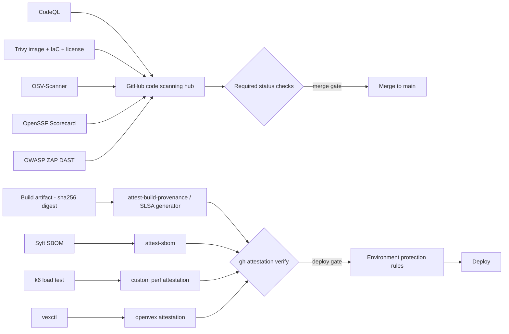

**Document type:** Implementation-actionable design guide (corpus-internal)
**Research topic:** `enterprise-sdlc-gitflow-attestation`
**Date:** 2026-06-15
**Grounded in (re-fetched at authoring time, accessed 2026-06-15):** GitHub code scanning / CodeQL, secret scanning + push protection, Dependabot + dependency review, GitHub Artifact Attestations (`actions/attest*`, `gh attestation verify`), SLSA GitHub Generator, Trivy, OSV-Scanner, OpenSSF Scorecard, Syft, OpenVEX `vexctl`, Grafana k6, OWASP ZAP, Gitsign, in-toto / SLSA / Sigstore, GitHub billing & Advanced Security pricing.
**Status:** DRAFT
**Companion to:** `PRODUCTION-READINESS-ATTESTATION-GATES.md` (the vendor-tool version — Snyk, Orca, cosign, Kyverno). This report answers the same question using only GitHub-native and free open-source tooling.

> **Thesis.** Nearly every enterprise quality and security gate — SAST, software-composition
> analysis, secret detection, container/IaC scanning, license compliance, SBOM, build provenance,
> supply-chain posture, peer review, load testing, and DAST — can be performed with tooling that is
> **free for open-source (public) repositories on GitHub**, and every gate's result can be turned
> into a **signed, digest-bound attestation** using GitHub's own keyless signing (no cosign keys, no
> KMS, no transparency-log infrastructure to operate). For a **private/enterprise** repository the
> picture splits cleanly: GitHub's *proprietary* scanners (CodeQL code scanning, secret scanning,
> dependency review) require a paid Code Security / Secret Protection license, but the *open-source
> Actions* (Trivy, OSV-Scanner, ZAP, Scorecard, Syft, `vexctl`, k6) plus *free artifact attestations*
> deliver equivalent coverage at **only the cost of Actions compute**. An enterprise on GitHub
> Enterprise Cloud can therefore layer these OSS gates as **additional services** and reserve license
> spend for only the GitHub-proprietary scanners it actually wants.

---

## 1. The model, in one paragraph

This report reuses the attestation primitive established in the companion guide: an **in-toto
Statement** binds a typed `predicate` to an artifact by content `digest` (subjects are "matched
purely by digest, regardless of content type"), and a **DSSE envelope** signs it so the claim is
authenticated and tamper-evident
([in-toto Statement spec](https://github.com/in-toto/attestation/blob/main/spec/v1/statement.md),
[in-toto envelope spec](https://github.com/in-toto/attestation/blob/main/spec/v1/envelope.md), both
accessed 2026-06-15). What changes here is the *toolchain*: instead of cosign + a vendor scanner, we
use GitHub's own signing actions and free OSS scanners. The verification machinery stays uniform —
fetch the signed attestation, confirm the digest matches, dispatch on predicate type, apply policy.

---

## 2. GitHub's free keyless signing backbone

The piece that makes "free attestations" real is **GitHub Artifact Attestations**, which "enable you
to create unfalsifiable provenance and integrity guarantees for the software you build" and are
"built on Sigstore"
([artifact attestations concept](https://docs.github.com/en/actions/concepts/security/artifact-attestations),
accessed 2026-06-15). The signing is keyless: there is no private key to manage — the workflow's
OIDC identity is exchanged for "a short-lived Sigstore-issued signing certificate"
([actions/attest](https://github.com/actions/attest), accessed 2026-06-15). A job declaring
`id-token: write` and `attestations: write` can sign any artifact with nothing more than the runner
it already has.

Three actions cover the common predicates, and one covers everything else:

- **`actions/attest-build-provenance`** binds an artifact "to a SLSA build provenance predicate using
  the in-toto format," signed with the short-lived Sigstore cert
  ([actions/attest-build-provenance](https://github.com/actions/attest-build-provenance),
  accessed 2026-06-15). On its own this "provides SLSA v1.0 Build Level 2"
  ([artifact attestations concept](https://docs.github.com/en/actions/concepts/security/artifact-attestations),
  accessed 2026-06-15).
- **`actions/attest-sbom`** binds "a Software Bill of Materials (SBOM) using the in-toto format" and
  accepts "either the SPDX or CycloneDX JSON-serialized format"
  ([actions/attest-sbom](https://github.com/actions/attest-sbom), accessed 2026-06-15).
- **`actions/attest`** is the general primitive: a `predicate-type` ("URI identifying the type of the
  predicate") plus a `predicate`/`predicate-path` — so **any scanner's JSON or SARIF can be signed as
  a custom-predicate attestation** bound to the artifact digest
  ([actions/attest](https://github.com/actions/attest), accessed 2026-06-15). This is the seam that
  lets Trivy, CodeQL, k6, or ZAP output become a first-class signed claim.

Storage and trust split by repo visibility: "Public repositories that generate artifact attestations
use the Sigstore Public Good Instance" with "a copy of the generated Sigstore bundle … written to an
immutable transparency log that is publicly readable," while "Private repositories … use GitHub's
Sigstore instance"
([artifact attestations concept](https://docs.github.com/en/actions/concepts/security/artifact-attestations),
accessed 2026-06-15).

Verification is `gh attestation verify`, which validates "the identity of the actor that produced the
attestation [and] the expected attestation predicate type," defaulting to `https://slsa.dev/provenance/v1`
and allowing `--predicate-type`, `--signer-workflow`, `--signer-repo`, and `--cert-identity[-regex]`
to pin trust precisely; it can run air-gapped with `gh attestation trusted-root` + `--bundle`
([gh attestation verify](https://cli.github.com/manual/gh_attestation_verify),
[verify offline](https://docs.github.com/en/actions/how-tos/secure-your-work/use-artifact-attestations/verify-attestations-offline),
both accessed 2026-06-15).

**Reaching SLSA Build L3 for free.** Where `attest-build-provenance` signs inline in the user's own
job (L2 class), `slsa-framework/slsa-github-generator` produces "non-forgeable SLSA provenance …
[meeting] the provenance generation and isolation requirements for SLSA Build level 3 and above" by
running generation in "a trusted / isolated re-usable workflow"
([slsa-github-generator](https://github.com/slsa-framework/slsa-github-generator),
accessed 2026-06-15). That isolation is exactly what SLSA L3 requires — the platform must "prevent
secret material used to sign the provenance from being accessible to the user-defined build steps"
([SLSA levels](https://slsa.dev/spec/v1.0/levels), accessed 2026-06-15) — delivered with no external
signing infrastructure.

---

## 3. The gate map — enterprise check → GitHub-free equivalent

| Enterprise gate | Typical commercial tool | GitHub-native / free-for-OSS tool | Evidence emitted | Predicate path |
| --- | --- | --- | --- | --- |
| SAST | (various) | CodeQL code scanning | SARIF → code scanning | custom via `actions/attest` |
| Dependency / SCA | Snyk | Dependabot alerts + dependency review + OSV-Scanner | alerts API / dep-review API / SARIF | custom / `vuln` |
| Secret detection | (various) | Secret scanning + push protection | alerts API; push block | n/a (preventive) |
| Container / image scan | Orca, Snyk | Trivy (`trivy-action`) | SARIF + CycloneDX/SPDX | `vuln` / SBOM |
| IaC / misconfiguration | Orca IaC | Trivy `config` (or Checkov) | SARIF | custom |
| License compliance | (various) | Trivy `--scanners license`; dependency review | SARIF / dep-review | custom |
| SBOM | SPDX/CycloneDX tooling | Syft (`anchore/sbom-action`), Trivy, dependency graph | SPDX / CycloneDX | `attest-sbom` |
| Vuln disposition (VEX) | OpenVEX | `vexctl` | OpenVEX JSON | `openvex` |
| Build provenance | SLSA generator | `attest-build-provenance` (L2) / `slsa-github-generator` (L3) | SLSA provenance | `slsaprovenance1` |
| Supply-chain posture | — | OpenSSF Scorecard | SARIF + OSSF API | custom |
| Peer review | branch protection | Rulesets + branch protection + CODEOWNERS (+ Gitsign) | reviews API; signed commits | custom code-review |
| Load / performance | k6 Cloud | k6 OSS (`setup-k6` + `run-k6`) | JSON/JUnit + exit code | custom perf |
| DAST | (various) | OWASP ZAP (`action-full-scan`) | report + SARIF 2.1.0 | custom |

The pipeline shape is the same as the vendor version, but every box is a free GitHub-native or OSS
component, and the SARIF outputs converge on one hub (the code-scanning tab):



---

## 4. The gates, one by one

### 4.1 SAST — CodeQL code scanning

CodeQL is "the code analysis engine developed by GitHub to automate security checks," and it is true
static analysis: it builds a database holding "the abstract syntax tree, the data flow graph, and the
control flow graph" and runs queries against it
([about CodeQL](https://docs.github.com/en/code-security/code-scanning/introduction-to-code-scanning/about-code-scanning-with-codeql),
[CodeQL overview](https://codeql.github.com/docs/codeql-overview/about-codeql/), both
accessed 2026-06-15). It covers the major languages — C/C++, C#, Go, Java/Kotlin, JavaScript/
TypeScript, Python, Ruby, Swift, and GitHub Actions workflows among them
([supported languages](https://codeql.github.com/docs/codeql-overview/supported-languages-and-frameworks/),
accessed 2026-06-15).

For OSS it is free and on by default: "All public repositories have access to code scanning"
([GHAS billing](https://docs.github.com/en/billing/concepts/product-billing/github-advanced-security),
accessed 2026-06-15), enabled with default setup (GitHub "automatically chooses the languages to
analyze") or advanced setup (a `github/codeql-action` workflow)
([about CodeQL](https://docs.github.com/en/code-security/code-scanning/introduction-to-code-scanning/about-code-scanning-with-codeql),
accessed 2026-06-15). Results become a merge gate: code scanning emits SARIF 2.1.0 that GitHub parses
"to display code scanning alerts," and on a PR the "Code scanning results" check "fails" on any
`error`, `critical`, or `high` finding
([SARIF support](https://docs.github.com/en/code-security/code-scanning/integrating-with-code-scanning/sarif-support-for-code-scanning),
[triaging in PRs](https://docs.github.com/en/code-security/code-scanning/managing-code-scanning-alerts/triaging-code-scanning-alerts-in-pull-requests),
both accessed 2026-06-15). Wrap that SARIF as a custom predicate via `actions/attest` to get a signed
"passed CodeQL at this commit" record.

### 4.2 Dependency / SCA — Dependabot + dependency review + OSV-Scanner

Three free layers, complementary rather than redundant:

- **Dependabot alerts** fire "when a new vulnerability is added to the GitHub Advisory Database," and
  **security updates** "fix vulnerable dependencies for you by raising pull requests"
  ([Dependabot alerts](https://docs.github.com/en/code-security/concepts/supply-chain-security/dependabot-alerts),
  [security updates](https://docs.github.com/en/code-security/concepts/supply-chain-security/about-dependabot-security-updates),
  both accessed 2026-06-15). The Advisory Database ships "as JSON files in the Open Source
  Vulnerability (OSV) format"
  ([advisory database](https://docs.github.com/en/code-security/concepts/vulnerability-reporting-and-management/about-the-github-advisory-database),
  accessed 2026-06-15).
- **Dependency review action** is the PR gate: it "scans your pull requests for dependency changes,
  and will raise an error if any vulnerabilities or invalid licenses are being introduced," and "A
  failed check blocks a pull request from being merged"; it is "available for all public repositories"
  ([about dependency review](https://docs.github.com/en/code-security/concepts/supply-chain-security/about-dependency-review),
  [dependency-review-action](https://github.com/actions/dependency-review-action), both
  accessed 2026-06-15).
- **OSV-Scanner** (Google, Apache-2.0) adds an independent second opinion: it is "an officially
  supported frontend to the OSV database," resolves lockfiles across dozens of ecosystems plus
  container layers, and its action uploads SARIF into code scanning by default
  ([osv-scanner](https://github.com/google/osv-scanner),
  [osv-scanner action](https://google.github.io/osv-scanner/github-action/), both
  accessed 2026-06-15).

### 4.3 Secret detection — secret scanning + push protection

Secret scanning "runs automatically for free" and "scans your entire Git history on all branches …
for hardcoded credentials, including API keys, passwords, tokens"
([about secret scanning](https://docs.github.com/en/code-security/secret-scanning/introduction/about-secret-scanning),
accessed 2026-06-15). Its preventive partner, push protection, "block[s] the push and provide[s] a
detailed message" when a secret is detected, and for an individual on GitHub.com it "Stops you from
pushing secrets to public repositories" at no cost
([about push protection](https://docs.github.com/en/code-security/secret-scanning/introduction/about-push-protection),
accessed 2026-06-15). This is a preventive gate (block-on-detect), not an attestation — but it
hardens the source the other attestations are built from.

### 4.4 Container, IaC, and license — Trivy

Trivy (Aqua, Apache-2.0) is the single highest-leverage free tool here: one binary "find[s]
vulnerabilities (CVE) & misconfigurations (IaC) across code repositories, binary artifacts, container
images, and Kubernetes clusters," and detects "Vulnerabilities (CVE); Misconfigurations
(Infrastructure as Code); Secrets; Software licenses"
([trivy.dev](https://trivy.dev/), [Trivy docs](https://trivy.dev/latest/docs/), both
accessed 2026-06-15). As a gate, `aquasecurity/trivy-action` exposes `scan-type` (`image`, `fs`,
`config`, `repo`, `rootfs`, `sbom`), a `format` that includes `sarif`, `cyclonedx`, `spdx-json`, and
`cosign-vuln`, a `severity` filter, and `exit-code: '1'` to fail the build on findings; SARIF uploads
to code scanning via `github/codeql-action/upload-sarif`
([trivy-action](https://github.com/aquasecurity/trivy-action), accessed 2026-06-15). License gating
maps licenses to severities ("Forbidden→CRITICAL, Restricted→HIGH")
([Trivy license scanner](https://trivy.dev/latest/docs/scanner/license/), accessed 2026-06-15), and
IaC scanning has "built-in checks to detect configuration issues in … Docker, Kubernetes, Terraform,
CloudFormation"
([Trivy misconfiguration](https://trivy.dev/latest/docs/scanner/misconfiguration/),
accessed 2026-06-15).

Trivy produces the predicate; signing is done by GitHub's `actions/attest` (custom predicate) or by
cosign. Trivy can emit a `cosign-vuln`-format record that cosign signs with `--type vuln`, recording
the result under predicate type `https://cosign.sigstore.dev/attestation/vuln/v1`
([Trivy vuln attestation](https://trivy.dev/latest/docs/supply-chain/attestation/vuln/),
[cosign vuln spec](https://github.com/sigstore/cosign/blob/main/specs/COSIGN_VULN_ATTESTATION_SPEC.md),
both accessed 2026-06-15).

> **Hard caveat.** In March 2026 the Trivy ecosystem was compromised (CVE-2026-33634): a threat actor
> "force-push[ed] 76 of 77 version tags in `aquasecurity/trivy-action` to credential-stealing
> malware." The advisory's remediation is the standing rule for *all* third-party Actions: "Pin
> GitHub Actions to full, immutable commit SHA hashes, don't use mutable version tags"
> ([GHSA-69fq-xp46-6x23](https://github.com/aquasecurity/trivy/security/advisories/GHSA-69fq-xp46-6x23),
> accessed 2026-06-15). Pin every action below by SHA, not tag.

### 4.5 SBOM — Syft (and Trivy, and the dependency graph)

`anchore/sbom-action` (Apache-2.0) "creat[es] a software bill of materials (SBOM) using Syft" in
SPDX or CycloneDX JSON and "automatically upload[s] all SBOMs as release assets" on a release
([sbom-action](https://github.com/anchore/sbom-action), accessed 2026-06-15). Bind it to the artifact
with `actions/attest-sbom`. Syft can also sign directly via Sigstore (`syft attest --output spdx-json`)
([Syft + Sigstore attestations](https://anchore.com/sbom/creating-sbom-attestations-using-syft-and-sigstore/),
accessed 2026-06-15). Trivy (§4.4) and the GitHub dependency graph are alternative SBOM sources.

### 4.6 Vulnerability disposition — OpenVEX

A clean scan is rarely zero findings. `vexctl` (Apache-2.0) is "a tool to create, apply, and attest
VEX," letting authors assert per-vulnerability status (`not_affected`, `affected`, `fixed`,
`under_investigation`) and "apply the VEX data to scanner results" to filter non-exploitable findings
([vexctl](https://github.com/openvex/vexctl), [OpenVEX spec](https://github.com/openvex/spec), both
accessed 2026-06-15). Attest the OpenVEX document alongside the scan so the gate can enforce "no
*undispositioned* high/critical vulnerabilities."

### 4.7 Build provenance — covered in §2

`attest-build-provenance` (SLSA L2) or `slsa-github-generator` (L3) — the anchor that makes every
other attestation trustworthy, because they are all signed by the same provable workflow identity.

### 4.8 Supply-chain posture — OpenSSF Scorecard

Scorecard (Apache-2.0) scores 0–10 heuristics — `Branch-Protection` (High), `Code-Review` (High),
`Token-Permissions` (least-privilege, High), `Dangerous-Workflow` (Critical), `Pinned-Dependencies`
(Medium), `Signed-Releases` (High) — and its action "uploads results in SARIF format" to code
scanning; setting `publish_results: true` publishes the run to the OpenSSF REST API (a public posture
attestation with a badge)
([scorecard](https://github.com/ossf/scorecard),
[scorecard-action](https://github.com/ossf/scorecard-action),
[checks docs](https://github.com/ossf/scorecard/blob/main/docs/checks.md), all accessed 2026-06-15).

### 4.9 Peer review — branch protection, rulesets, CODEOWNERS, Gitsign

GitHub turns review into an enforced, attestable gate at no cost. Rulesets / branch protection can
"require that all pull requests receive a specific number of approving reviews," require "reviews from
code owners," "dismiss stale pull request approvals when commits are pushed that affect the diff,"
require signed-and-verified commits, and enforce linear history
([about protected branches](https://docs.github.com/en/repositories/configuring-branches-and-merges-in-your-repository/managing-protected-branches/about-protected-branches),
[available rules for rulesets](https://docs.github.com/en/repositories/configuring-branches-and-merges-in-your-repository/managing-rulesets/available-rules-for-rulesets),
both accessed 2026-06-15). The review fact is read from the pull-request reviews API in CI and signed
as a custom code-review predicate over the build digest (see the companion guide §8). **Gitsign**
(sigstore/gitsign, Apache-2.0) adds keyless commit signing "with your own GitHub / OIDC identity," so
the "require signed commits" rule can be satisfied without long-lived GPG keys
([gitsign](https://github.com/sigstore/gitsign), accessed 2026-06-15).

### 4.10 Load / performance — Grafana k6

k6 is open-source (run free in Actions via `grafana/setup-k6-action` + `grafana/run-k6-action`, both
Apache-2.0)
([setup-k6-action](https://github.com/grafana/setup-k6-action),
[run-k6-action](https://github.com/grafana/run-k6-action), both accessed 2026-06-15). The gate is
k6's **thresholds**: "the pass/fail criteria that you define for your test metrics," and on failure
"k6 would exit with a non-zero exit code" — specifically `ThresholdsHaveFailed = 99`
([k6 thresholds](https://grafana.com/docs/k6/latest/using-k6/thresholds/),
[k6 exit codes](https://github.com/grafana/k6/blob/master/errext/exitcodes/codes.go), both
accessed 2026-06-15). The JSON/JUnit summary becomes a custom performance attestation bound to the
artifact (there is no standard performance predicate — see Limitations).

> **Note:** the older `grafana/k6-action` is archived; use `setup-k6-action` + `run-k6-action`. The
> threshold→exit-code behavior is a property of k6 itself, propagated by the action, not an action
> input.

### 4.11 DAST — OWASP ZAP

`zaproxy/action-full-scan` (Apache-2.0) runs "the ZAP Full Scan to perform Dynamic Application
Security Testing (DAST)" — spider plus active scan — attaches the report as a build artifact, and
`fail_action: true` fails the run on alerts
([zaproxy/action-full-scan](https://github.com/zaproxy/action-full-scan), accessed 2026-06-15). ZAP's
engine can emit a SARIF 2.1.0 report
([ZAP SARIF report](https://www.zaproxy.org/docs/desktop/addons/report-generation/report-sarif-json/),
accessed 2026-06-15) for upload into code scanning.

> **Honest detail:** SARIF emission is a ZAP *engine* report add-on, not a native input on the
> action (the current `action-full-scan` inputs are `target`, `rules_file_name`, `cmd_options`,
> `fail_action`, `artifact_name`, etc.). Produce SARIF via the Automation Framework / `cmd_options`
> and upload it as a follow-on step.

---

## 5. The SARIF hub and required status checks

The unifying mechanism: GitHub code scanning ingests SARIF from *any* tool — "GitHub can parse SARIF
files produced by third-party tools to display code scanning alerts"
([SARIF support](https://docs.github.com/en/code-security/code-scanning/integrating-with-code-scanning/sarif-support-for-code-scanning),
accessed 2026-06-15). CodeQL, Trivy, OSV-Scanner, Scorecard, and ZAP all normalize on SARIF, so every
gate's findings land in one Security tab. To turn any of them into a *merge* gate, wire its check into
**required status checks**: GitHub allows the merge only once "all required CI tests are passing"
([available rules for rulesets](https://docs.github.com/en/repositories/configuring-branches-and-merges-in-your-repository/managing-rulesets/available-rules-for-rulesets),
accessed 2026-06-15). A red scan blocks the merge — purely through GitHub configuration, no external
policy engine.

---

## 6. Enforcement — merge-time and deploy-time, all native

**Merge-time** is §5: branch-protection/ruleset rules plus required status checks gate the PR.

**Deploy-time** uses deployment **Environments**: "A job that references an environment must follow
any protection rules for the environment before running or accessing the environment's secrets,"
where rules include required reviewers ("only one of the required reviewers needs to approve"), a wait
timer, and deployment branch policies; rejection fails the workflow
([using environments](https://docs.github.com/actions/deployment/targeting-different-environments/using-environments-for-deployment),
[reviewing deployments](https://docs.github.com/actions/managing-workflow-runs/reviewing-deployments),
both accessed 2026-06-15). The cryptographic check slots into the same deploy job: `gh attestation
verify` exits non-zero on failure, so running it before the deploy step halts an unverified artifact —
a fail-closed verification gate enforced by an exit code
([gh attestation verify](https://cli.github.com/manual/gh_attestation_verify),
accessed 2026-06-15).

> **Honest boundary — what GitHub does NOT do.** No GitHub-native control performs **Kubernetes
> admission control**. GitHub gates *merges* and *deployment jobs*; it does not validate or reject
> workloads as they admit to a cluster. If you need the runtime gate (verify the same attestations at
> the cluster boundary), that piece — Sigstore policy-controller or Kyverno — is **external** to
> GitHub and is the one place the companion vendor guide's enforcement layer still applies. The OSS
> tools there (Kyverno, policy-controller) are themselves free, but they are not GitHub features.

---

## 7. The cost reality — what is actually free, and where licensing starts

This is the demonstration the report is for. The line is **repository visibility**.

**(a) Public / open-source repos: the GitHub-proprietary scanners are free.** "A subset of Advanced
Security features are available to all public repositories on GitHub.com free of charge," and "code
scanning and secret scanning … are enabled for public repositories by default"
([GHAS billing](https://docs.github.com/en/billing/concepts/product-billing/github-advanced-security),
[about GHAS](https://docs.github.com/en/get-started/learning-about-github/about-github-advanced-security),
both accessed 2026-06-15). The security-features matrix lists code scanning, secret scanning alerts,
push protection, dependency review, and the CodeQL CLI as "Available for public repositories by
default," with the dependency graph and Dependabot family "available for all GitHub plans"
([security features](https://docs.github.com/en/code-security/getting-started/github-security-features),
accessed 2026-06-15). Plus Actions compute itself: "GitHub Actions usage is free for … public
repositories that use standard GitHub-hosted runners"
([Actions billing](https://docs.github.com/en/billing/concepts/product-billing/github-actions),
accessed 2026-06-15). **So an enterprise's public projects get the entire gate set — proprietary
scanners and OSS Actions alike — at zero cost.**

**(b) Private / internal repos: the proprietary scanners need a license.** "To run the feature on
your private or internal repositories, you must purchase the relevant GitHub Advanced Security
product," and "Use of Advanced Security features in all other repositories requires a license"
([about GHAS](https://docs.github.com/en/get-started/learning-about-github/about-github-advanced-security),
[GHAS billing](https://docs.github.com/en/billing/concepts/product-billing/github-advanced-security),
both accessed 2026-06-15). Since the March 2025 repackaging the license is one of two SKUs — **GitHub
Secret Protection at $19/active committer/month** (secret scanning + push protection) and **GitHub
Code Security at $30/active committer/month** (code scanning, premium Dependabot, dependency review) —
billed per unique active committer via metered billing
([SKU announcement](https://github.blog/changelog/2025-03-04-introducing-github-secret-protection-and-github-code-security/),
accessed 2026-06-15).

**(c) The OSS Actions carry no GitHub license fee on any repo.** Trivy, OSV-Scanner, ZAP, Scorecard,
Syft, `vexctl`, and k6 are not GitHub products — they run on Actions compute and surface via SARIF /
attestations. On private repos you pay only metered Actions minutes
([Actions billing](https://docs.github.com/en/billing/concepts/product-billing/github-actions),
accessed 2026-06-15); on public repos, nothing.

**The net for an enterprise on GitHub Enterprise Cloud:**

| Gate | Public repo | Private repo |
| --- | --- | --- |
| CodeQL SAST | Free | Code Security license ($30/committer) |
| Secret scanning + push protection | Free | Secret Protection license ($19/committer) |
| Dependency review | Free | Code Security license |
| Dependabot alerts / updates | Free | Free (all plans) |
| Trivy (container/IaC/license/SBOM) | Free | Actions compute only |
| OSV-Scanner (SCA) | Free | Actions compute only |
| OpenSSF Scorecard (posture) | Free | Actions compute only |
| Syft SBOM | Free | Actions compute only |
| OpenVEX `vexctl` | Free | Actions compute only |
| k6 load test | Free | Actions compute only |
| OWASP ZAP DAST | Free | Actions compute only |
| Artifact attestations (signing) | Free (public-good Sigstore) | GitHub Sigstore instance; Actions compute |
| Branch protection / rulesets / Environments | Free | Free |

The actionable conclusion: even on private enterprise code, you can reproduce SAST (Trivy + others),
SCA (OSV-Scanner + Dependabot, the latter free anyway), container/IaC/license/SBOM (Trivy/Syft), VEX,
load, and DAST coverage **with OSS Actions at only Actions-compute cost** — reserving Code Security /
Secret Protection spend for *only* the GitHub-proprietary engines (CodeQL's depth, native secret
scanning, native dependency review) you specifically value.

---

## 8. A reference free pipeline (illustrative)

A single workflow stitching the free gates together. Pin every third-party action to a commit SHA
(§4.4); the SHAs below are placeholders.

```yaml
name: attested-gates
on: [push, pull_request]
permissions:
  contents: read
  security-events: write   # SARIF upload to code scanning
  id-token: write          # keyless attestation signing
  attestations: write

jobs:
  scan-and-attest:
    runs-on: ubuntu-latest
    steps:
      - uses: actions/checkout@<sha>

      # SAST (free on public; advanced setup also works)
      - uses: github/codeql-action/init@<sha>
        with: { languages: 'javascript' }
      - uses: github/codeql-action/analyze@<sha>

      # SCA second opinion
      - uses: google/osv-scanner-action/.github/workflows/osv-scanner-reusable.yml@<sha>

      # Supply-chain posture
      - uses: ossf/scorecard-action@<sha>
        with: { results_file: scorecard.sarif, results_format: sarif, publish_results: true }
      - uses: github/codeql-action/upload-sarif@<sha>
        with: { sarif_file: scorecard.sarif }

      # Container + IaC + license scan, fail on HIGH/CRITICAL, emit SARIF + SBOM
      - uses: aquasecurity/trivy-action@<sha>
        with:
          scan-type: image
          image-ref: ghcr.io/org/app@${{ steps.build.outputs.digest }}
          format: sarif
          output: trivy.sarif
          severity: HIGH,CRITICAL
          exit-code: '1'
      - uses: github/codeql-action/upload-sarif@<sha>
        with: { sarif_file: trivy.sarif }

      # SBOM
      - uses: anchore/sbom-action@<sha>
        with: { format: spdx-json, output-file: sbom.spdx.json }

      # Sign provenance + SBOM, keyless (free)
      - uses: actions/attest-build-provenance@<sha>
        with: { subject-name: ghcr.io/org/app, subject-digest: ${{ steps.build.outputs.digest }} }
      - uses: actions/attest-sbom@<sha>
        with:
          subject-digest: ${{ steps.build.outputs.digest }}
          sbom-path: sbom.spdx.json

  load-test:
    runs-on: ubuntu-latest
    steps:
      - uses: actions/checkout@<sha>
      - uses: grafana/setup-k6-action@<sha>
      - uses: grafana/run-k6-action@<sha>   # thresholds → exit 99 fails the gate
        with: { path: ./tests/load.js }

  deploy:
    needs: [scan-and-attest, load-test]
    environment: production            # required reviewers / wait timer / branch policy
    runs-on: ubuntu-latest
    steps:
      - run: gh attestation verify oci://ghcr.io/org/app@${{ needs.scan-and-attest.outputs.digest }} \
               --owner org --signer-workflow org/repo/.github/workflows/attested-gates.yml
        # non-zero exit = fail closed before deploy
```

---

## 9. Honest limitations

- **CodeQL, secret scanning, and dependency review are free only on public repos.** On private/
  internal repos they require Code Security / Secret Protection licenses (§7). The OSS Actions close
  that gap functionally but are not a like-for-like CodeQL replacement (CodeQL's dataflow depth is
  distinctive).
- **GitHub provides no Kubernetes admission control** (§6). The runtime verify-at-admission gate is
  external (Kyverno / policy-controller).
- **No standard performance predicate.** k6 results ride a custom predicate (or the generic in-toto
  test-result type). SARIF and JUnit are evidence formats, not predicate types.
- **ZAP SARIF is an engine report, not a native action input** (§4.11) — emit via the Automation
  Framework and upload as a separate step.
- **Third-party action supply-chain risk is real.** The Trivy `trivy-action` compromise
  (CVE-2026-33634) is the cautionary case; **pin every third-party action to a full commit SHA**, and
  consider running Scorecard's `Pinned-Dependencies` and `Dangerous-Workflow` checks on your own
  workflows.
- **Private-repo artifact attestations** route to GitHub's Sigstore instance (Enterprise Cloud) rather
  than the public-good transparency log; verify against the appropriate trusted root.
- **A signed attestation proves a gate ran and was recorded, not that it passed** — the verifying
  policy must inspect the verdict field, and signer identity must be pinned first
  (`--signer-workflow` / `--cert-identity`).

---

## 10. Sources

All re-fetched at authoring time, accessed 2026-06-15. Primary specifications, official docs, and
project repositories only.

- GitHub code scanning / CodeQL: <https://docs.github.com/en/code-security/code-scanning> ·
  <https://codeql.github.com>
- GitHub secret scanning + push protection: <https://docs.github.com/en/code-security/secret-scanning>
- Dependabot + dependency review + Advisory Database:
  <https://docs.github.com/en/code-security> · <https://github.com/actions/dependency-review-action>
- GitHub Artifact Attestations + `gh attestation verify`:
  <https://github.com/actions/attest> · <https://github.com/actions/attest-build-provenance> ·
  <https://github.com/actions/attest-sbom> · <https://cli.github.com/manual/gh_attestation_verify> ·
  <https://docs.github.com/en/actions/concepts/security/artifact-attestations>
- SLSA GitHub Generator + SLSA spec: <https://github.com/slsa-framework/slsa-github-generator> ·
  <https://slsa.dev>
- in-toto attestation framework: <https://github.com/in-toto/attestation>
- Trivy + advisory: <https://trivy.dev> · <https://github.com/aquasecurity/trivy-action> ·
  <https://github.com/aquasecurity/trivy/security/advisories/GHSA-69fq-xp46-6x23>
- OSV-Scanner + OSV.dev: <https://github.com/google/osv-scanner> · <https://osv.dev>
- OpenSSF Scorecard: <https://github.com/ossf/scorecard> · <https://github.com/ossf/scorecard-action>
- Syft / SBOM: <https://github.com/anchore/sbom-action>
- OpenVEX `vexctl`: <https://github.com/openvex/vexctl> · <https://github.com/openvex/spec>
- Grafana k6: <https://github.com/grafana/setup-k6-action> ·
  <https://github.com/grafana/run-k6-action> · <https://grafana.com/docs/k6>
- OWASP ZAP: <https://github.com/zaproxy/action-full-scan> ·
  <https://www.zaproxy.org/docs/desktop/addons/report-generation/report-sarif-json/>
- Gitsign: <https://github.com/sigstore/gitsign>
- GitHub branch protection / rulesets / environments / billing:
  <https://docs.github.com/en/repositories/configuring-branches-and-merges-in-your-repository> ·
  <https://docs.github.com/actions/deployment/targeting-different-environments/using-environments-for-deployment> ·
  <https://docs.github.com/en/billing/concepts/product-billing/github-actions>
- GitHub Advanced Security pricing / SKUs:
  <https://docs.github.com/en/billing/concepts/product-billing/github-advanced-security> ·
  <https://github.blog/changelog/2025-03-04-introducing-github-secret-protection-and-github-code-security/>
