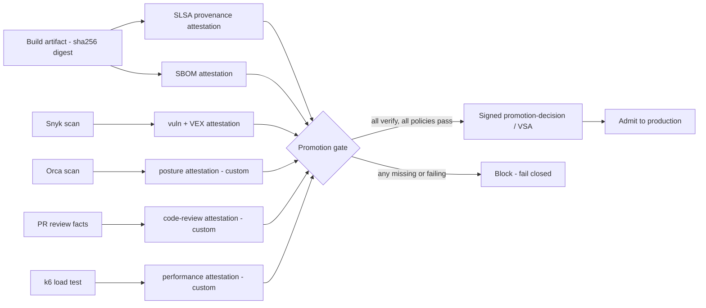

# Verifying Production-Readiness Gates with Attestations

**Document type:** Implementation-actionable design guide (corpus-internal)
**Research topic:** `enterprise-sdlc-gitflow-attestation`
**Date:** 2026-06-15
**Grounded in (re-fetched at authoring time, accessed 2026-06-15):** in-toto Attestation Framework v1, SLSA v1.0 / v1.2, Sigstore cosign + Fulcio + Rekor, GitHub Artifact Attestations, SPDX / CycloneDX, OpenVEX, Snyk CLI, Orca Security shift-left Actions, Grafana k6, Sigstore policy-controller, Kyverno, OPA / Conftest.
**Status:** DRAFT

> **Thesis.** Every production-readiness gate — a build, a dependency scan, a cloud-posture
> check, a peer review, a load test — produces a *fact* about one specific artifact. An
> **attestation** is that fact, expressed in a typed schema, cryptographically bound to the
> artifact's content digest, and signed. Once each gate emits an attestation, "is this artifact
> ready for production?" stops being a question of trusting a CI dashboard and becomes a
> **mechanical verification**: does the artifact's digest carry a valid, signed, policy-passing
> attestation of every required type, from an expected signer? This guide shows how to wire
> Orca, Snyk, pull-request review, load testing, and the other likely gates into that model.

---

## 1. The one primitive everything rests on

All of the gates below converge on a single data structure: the **in-toto Statement**. It has
four parts that matter here ([in-toto Statement spec](https://github.com/in-toto/attestation/blob/main/spec/v1/statement.md),
accessed 2026-06-15):

- `_type` — fixed to `https://in-toto.io/Statement/v1`.
- `subject[]` — the artifact(s) the claim applies to. Each element **MUST** carry a `digest`,
  and "Subject artifacts are matched purely by digest, regardless of content type."
- `predicateType` — a URI naming *what kind of claim* this is.
- `predicate` — the typed body holding the claim's actual data.

```json
{
  "_type": "https://in-toto.io/Statement/v1",
  "subject": [
    { "name": "ghcr.io/acme/checkout", "digest": { "sha256": "9f86d0…" } }
  ],
  "predicateType": "https://cosign.sigstore.dev/attestation/vuln/v1",
  "predicate": { "scanner": { "result": "PASSED" }, "metadata": { "scanFinishedOn": "2026-06-15T14:02:11Z" } }
}
```

The `predicate` is "arbitrary metadata about the Statement's `subject`," and `predicateType`
"identif[ies] what the predicate means"
([in-toto predicate spec](https://github.com/in-toto/attestation/blob/main/spec/v1/predicate.md),
accessed 2026-06-15). That is the extensibility seam: a gate either **reuses a registered
predicate type** or **mints its own URI**. The in-toto project maintains a registry of vetted
types — SLSA Provenance, SPDX / CycloneDX SBOMs, Test Result, VULNS, VSA, Link, SCAI, Release
([in-toto predicate registry](https://github.com/in-toto/attestation/blob/main/spec/predicates/README.md),
accessed 2026-06-15).

The Statement is then sealed in a **DSSE envelope** (Dead Simple Signing Envelope): the payload
"MUST be a base64-encoded JSON Statement," `signatures` "MUST be defined as an array," and the
`payloadType` (`application/vnd.in-toto+json`) "MUST be signed along with the payload"
([in-toto envelope spec](https://github.com/in-toto/attestation/blob/main/spec/v1/envelope.md),
accessed 2026-06-15). Signing makes the claim authenticated and tamper-evident; the digest binding
welds it to one exact build so a scan result for `sha256:9f86d0…` cannot be silently reused for a
different binary.

**Why this matters for production readiness:** the verification machinery is *identical* for every
gate. Fetch the envelope, verify the signature, decode the Statement, confirm a `subject[].digest`
matches the artifact in hand, dispatch on `predicateType`, then apply policy to the typed
`predicate`. A reviewer-approval claim and a load-test claim verify the same way.

---

## 2. Sign, store, verify — the machinery

Two interchangeable toolchains implement the signing/storage/verification lifecycle. Most
enterprises use both: GitHub-native for the build, cosign for everything attached afterward.

### 2.1 Sigstore cosign

`cosign attest --predicate <file> --type <TYPE> --key cosign.key <IMAGE>` creates and signs an
attestation from a local predicate file and attaches it to an OCI image
([cosign attest reference](https://github.com/sigstore/cosign/blob/main/doc/cosign_attest.md),
accessed 2026-06-15). The `--type` flag accepts a known keyword
(`slsaprovenance1 | link | spdx | spdxjson | cyclonedx | vuln | openvex | custom`) **or any URI**,
defaulting to `custom`. Payloads "are signed using the DSSE signing spec," and cosign "has built-in
support for in-toto attestations"
([cosign attestation docs](https://docs.sigstore.dev/cosign/verifying/attestation/),
accessed 2026-06-15).

Sign **by digest, not tag** — "you should always sign images based on their digest (`@sha256:...`)
rather than a tag (`:latest`) because otherwise you might sign something you didn't intend to"
([cosign README](https://github.com/sigstore/cosign/blob/main/README.md), accessed 2026-06-15).

**Keyless signing** removes long-lived keys: cosign authenticates via OIDC and "request[s] a code
signing certificate from the Fulcio certificate authority," which "issues short-lived certificates
binding an ephemeral key to an OpenID Connect identity"
([cosign signing overview](https://docs.sigstore.dev/cosign/signing/overview/),
accessed 2026-06-15). In CI the OIDC identity is the workflow itself, so the *signer* is provably
"this repo's release pipeline," not a person holding a secret.

### 2.2 The Rekor transparency log

In keyless mode cosign "store[s] the signature and certificate in the Rekor transparency log"
([cosign README](https://github.com/sigstore/cosign/blob/main/README.md), accessed 2026-06-15).
Rekor is "an immutable tamper resistant ledger of metadata"
([sigstore/rekor](https://github.com/sigstore/rekor), accessed 2026-06-15) built on a Merkle tree;
"the log is append-only and once entries are added they cannot be modified; a valid log can be
cryptographically verified by any third-party"
([Sigstore security model](https://docs.sigstore.dev/about/security/), accessed 2026-06-15). This
gives non-repudiation: a verifier can later prove the gate's attestation existed at signing time.

> **Caveat to record.** A Rekor **v1** entry's internal timestamp "comes from Rekor's internal
> clock, which is not externally verifiable … meaning the timestamp is mutable in Rekor without
> detection"; with **Rekor v2**, clients "get a signed timestamp from a timestamp authority separate
> from Rekor" ([cosign timestamps](https://docs.sigstore.dev/cosign/verifying/timestamps/),
> accessed 2026-06-15). If a gate's freshness check depends on the attestation timestamp, source it
> from a timestamp authority (or the gate's own predicate field), not the Rekor v1 SET.

### 2.3 GitHub Artifact Attestations

GitHub's native path "establish[es] where and how your software was built"
([GitHub artifact attestations](https://docs.github.com/en/actions/security-for-github-actions/using-artifact-attestations/using-artifact-attestations-to-establish-provenance-for-builds),
accessed 2026-06-15). The `actions/attest` action binds "some subject (a named artifact along with
its digest) to a predicate," uses the workflow's OIDC identity (`id-token: write`,
`attestations: write`), signs with "a short-lived Sigstore-issued signing certificate," and saves
the result "in the JSON-serialized Sigstore bundle format"
([actions/attest](https://github.com/actions/attest), accessed 2026-06-15). Sibling actions cover
the common predicates: `actions/attest-build-provenance` binds a SLSA provenance predicate "using
the in-toto format" ([actions/attest-build-provenance](https://github.com/actions/attest-build-provenance),
accessed 2026-06-15), and `actions/attest-sbom` binds an SPDX- or CycloneDX-formatted SBOM
([actions/attest-sbom](https://github.com/actions/attest-sbom), accessed 2026-06-15).

Verification is `gh attestation verify`, which checks "the integrity and provenance of an artifact
using its associated cryptographically signed attestations" and lets policy pin the predicate type
and signer: `--predicate-type` (default `https://slsa.dev/provenance/v1`), `--signer-workflow`,
`--cert-identity`, `--cert-oidc-issuer`
([gh attestation verify](https://cli.github.com/manual/gh_attestation_verify), accessed 2026-06-15).
It can run air-gapped with `--bundle` + `--custom-trusted-root`
([verifying offline](https://docs.github.com/en/actions/security-for-github-actions/using-artifact-attestations/verifying-attestations-offline),
accessed 2026-06-15).

---

## 3. The gate matrix

Each production-readiness gate maps to a predicate type and a verification policy. "Reuse" means a
registered/vendor predicate type exists; "custom" means you mint a `predicateType` URI and define
the body.

| Gate | Evidence the tool emits | Predicate type | Status |
| --- | --- | --- | --- |
| Build provenance | Builder ID, build definition, resolved deps | `https://slsa.dev/provenance/v1` | Reuse |
| SBOM | SPDX or CycloneDX document | `https://spdx.dev/Document` / `https://cyclonedx.org/bom` | Reuse |
| Dependency / vuln scan (Snyk) | SARIF + pass/fail exit code | `https://cosign.sigstore.dev/attestation/vuln/v1` | Reuse |
| Vuln disposition (VEX) | Per-CVE exploitability status | `https://openvex.dev/ns` | Reuse |
| Cloud posture / image scan (Orca) | SARIF or JSON report + exit code | `custom` (wrap report) | Custom |
| Peer review / PR approval | Reviewer set, approval count, decision | `custom` code-review, or SLSA Source track | Custom / Reuse |
| Unit + integration tests | Pass/fail per test, JUnit XML | `https://in-toto.io/attestation/test-result/v0.1` | Reuse |
| Load / performance test (k6) | Thresholds, p95, error rate, verdict | `custom` performance-test | Custom |
| DAST (e.g. ZAP) | SARIF findings | `custom` (wrap SARIF) | Custom |
| Code coverage | Cobertura XML / lcov, % covered | `custom` coverage | Custom |
| Final gate decision | Which gates passed, policy hashes | `custom` / SLSA VSA | Custom / Reuse |

The pipeline shape is the same regardless of which rows you enable:



---

## 4. Build provenance (SLSA) — the anchor gate

SLSA Provenance (`predicateType: https://slsa.dev/provenance/v1`) describes "how an artifact or set
of artifacts was produced so that consumers of the provenance can verify that the artifact was built
according to expectations" ([SLSA provenance spec](https://slsa.dev/spec/v1.0/provenance),
accessed 2026-06-15). Its `buildDefinition` (build type, external parameters, resolved
dependencies) and `runDetails` (`builder.id`, timestamps) establish origin. The SLSA **Build
levels** grade forgeability resistance: L1 provenance "is trivial to bypass or forge," L2 requires
a hosted build platform with signed provenance, and L3 "hardened builds" require "exploiting a
vulnerability that is beyond the capabilities of most adversaries"
([SLSA levels](https://slsa.dev/spec/v1.0/levels), accessed 2026-06-15).

Provenance is the **anchor**: it proves the artifact came from your pipeline at all. The other
gates' attestations are only trustworthy because they are signed by that same pipeline identity.
Produce it with `actions/attest-build-provenance` at build time; this is the one gate with
first-class, zero-custom-code tooling on both GitHub and cosign.

**Verification expectation:** SLSA defines verification as "check that the package's provenance
meets your expectations," where expectations are "known provenance values that indicate the
corresponding artifact is authentic," and the verifier is configured with "the recognized builder
identities" ([SLSA verifying artifacts](https://slsa.dev/spec/v1.0/verifying-artifacts),
accessed 2026-06-15). Concretely: pin the builder/`--signer-workflow` and the source repository.

---

## 5. SBOM gate

Generate the bill of materials and bind it to the digest. SPDX is "an open standard for
communicating software bill of material information" and an ISO/IEC standard
([SPDX overview](https://spdx.dev/about/overview/), accessed 2026-06-15); CycloneDX is a "modular
and extensible framework" that can carry both SBOM and VEX
([CycloneDX overview](https://cyclonedx.org/specification/overview/), accessed 2026-06-15).

Attach with `cosign attest --type spdxjson --predicate sbom.spdx.json <IMAGE>@<DIGEST>` (predicate
type `https://spdx.dev/Document`) or `--type cyclonedx` (`https://cyclonedx.org/bom`), or use
`actions/attest-sbom`.

> **Design note.** Sigstore warns the SBOM-predicate path embeds "the entire SBOM … in the signature
> bundle, and so you will have to download the entire SBOM every time you want to verify the
> signature" ([cosign other types](https://docs.sigstore.dev/cosign/signing/other_types/),
> accessed 2026-06-15). For large SBOMs, attach the SBOM as an OCI referrer and attest a *digest of
> the SBOM* rather than inlining it.

The SBOM gate is rarely a hard pass/fail by itself; it is the **input** the vuln gate and VEX gate
operate over, and the artifact auditors will demand.

---

## 6. Dependency / vulnerability scan gate — Snyk

Snyk is the worked example for a vuln gate. `snyk test` "checks projects for open-source
vulnerabilities and license issues," and its **exit code is the gate signal**: `0` = no
vulnerabilities, `1` = vulnerabilities found, `2` = scan failure
([snyk test](https://docs.snyk.io/developer-tools/snyk-cli/commands/test), accessed 2026-06-15).
`--severity-threshold=<low|medium|high|critical>` sets the bar ("Report only vulnerabilities at the
specified level or higher"), and `--sarif-file-output=<path>` writes machine-readable SARIF. Snyk
can also generate the SBOM directly: `snyk sbom --format=cyclonedx1.6+json` (or `spdx2.3+json`)
([snyk sbom](https://docs.snyk.io/developer-tools/snyk-cli/commands/sbom), accessed 2026-06-15), and
`snyk sbom test` re-checks an SBOM with the same exit-code semantics
([snyk sbom test](https://docs.snyk.io/developer-tools/snyk-cli/commands/sbom-test),
accessed 2026-06-15).

> **Honest boundary.** Snyk has **no native `attest` verb**. Its machine-readable output is
> SARIF + SBOM; the attestation step is performed by cosign wrapping that output. Do not design
> around a `snyk attest` command — it does not exist as of 2026-06-15.

**Pattern:**

```bash
snyk test --severity-threshold=high --sarif-file-output=snyk.sarif   # exit 1 fails the job
cosign attest --type vuln --predicate snyk.sarif <IMAGE>@<DIGEST>     # predicate https://cosign.sigstore.dev/attestation/vuln/v1
```

The `vuln` predicate type resolves to `https://cosign.sigstore.dev/attestation/vuln/v1`
([cosign attestation package](https://pkg.go.dev/github.com/sigstore/cosign/v2/pkg/cosign/attestation),
accessed 2026-06-15). The result: a signed, digest-bound record that "this artifact passed a Snyk
scan at the high-severity threshold."

### 6.1 VEX — dispositioning the findings a clean scan still has

A "clean" scan is rarely literally zero findings. **OpenVEX** lets the author assert, per
vulnerability, "the impact a vulnerability has on one or more software products"
([OpenVEX spec](https://github.com/openvex/spec/blob/main/OPENVEX-SPEC.md), accessed 2026-06-15)
with exactly four statuses: `not_affected`, `affected`, `fixed`, `under_investigation`. A
`not_affected` status "requires the addition of a justification" from a fixed enum (e.g.
`vulnerable_code_not_in_execute_path`). `vexctl` is the tool "to create, transform and attest VEX
metadata" ([vexctl](https://github.com/openvex/vexctl), accessed 2026-06-15); when embedding VEX in
an attestation "the subjects SHOULD move from the VEX statement product to the attestation subjects"
([OpenVEX attesting](https://github.com/openvex/spec/blob/main/ATTESTING.md), accessed 2026-06-15),
binding the disposition to the artifact digest. Attach with `cosign attest --type openvex`
(`https://openvex.dev/ns`).

This pairing — a `vuln` attestation for the scan, an `openvex` attestation for the residue — is what
lets a gate enforce "no unaddressed high/critical vulnerabilities" without demanding the impossible
"zero findings."

---

## 7. Cloud-posture / container-image scan gate — Orca Security

Orca is a documented production-readiness gate today, but the attestation wrapping is a pattern you
add — be precise about the line.

**What Orca documents.** Orca is an agentless CNAPP unifying "CSPM, CWPP, CIEM, DSPM, Container
Security" ([Orca CNAPP platform](https://orca.security/platform/cnapp-cloud-security-platform/),
accessed 2026-06-15). Its shift-left capability scans "container images and IaC templates … as part
of regular, continuous integration (CI) / continuous delivery" with "guardrail policies in place to
prevent insecure deployments" ([Orca shift-left](https://orca.security/platform/shift-left-security/),
accessed 2026-06-15), and policy severity governs the gate: teams can "automatically block risky
builds, stop builds depending on risk severity, or allow builds to proceed while warning developers"
([Orca: what is shift-left security](https://orca.security/resources/blog/what-is-shift-left-security/),
accessed 2026-06-15).

The concrete, attestable evidence comes from Orca's official GitHub Actions. The container-image
Action exposes `format` (`cli | json | sarif`), `output` (results directory), and an `exit_code`
input — "Exit code for failed execution due to policy violations" (default `3`) — writing results
to `results/image.sarif`
([orcasecurity/shiftleft-container-image-action](https://github.com/orcasecurity/shiftleft-container-image-action/blob/main/README.md),
accessed 2026-06-15). The IaC Action mirrors this for Terraform / CloudFormation / ARM
([orcasecurity/shiftleft-iac-action](https://github.com/orcasecurity/shiftleft-iac-action/blob/main/README.md),
accessed 2026-06-15).

> **Honest gap.** No Orca primary source documents Orca signing its output or emitting an
> in-toto / SLSA / cosign attestation. What Orca emits is **attestation-ready** SARIF/JSON plus a
> deterministic `exit_code`. Binding that report to an artifact digest, signing it, and verifying it
> downstream is a **consumer-built integration**, not an Orca feature.

**Pattern (custom predicate):**

```bash
# Orca Action writes results/image.sarif and sets outputs.exit_code (0 = clean)
cosign attest \
  --type https://orca.security/scan-result/v1 \
  --predicate results/image.sarif \
  <IMAGE>@<DIGEST>
```

Mint the `https://orca.security/scan-result/v1` URI (a `custom` predicate), carry the SARIF report
(or a normalized summary: counts by severity, the Orca `exit_code`, scan timestamp) as the body, and
verify it at the gate like any other predicate.

---

## 8. Peer review / pull-request approval gate

GitHub turns code review into a machine-enforced gate and leaves a queryable trail you can attest.

**Configure the gate.** Branch protection or repository rulesets can "require that all pull requests
receive a specific number of approving reviews before someone merges," require that "any pull request
that affects code with a code owner must be approved by that code owner," and "dismiss stale pull
request approvals when commits are pushed that affect the diff"
([about protected branches](https://docs.github.com/en/repositories/configuring-branches-and-merges-in-your-repository/managing-protected-branches/about-protected-branches),
accessed 2026-06-15). Companion rules — required status checks, required signed commits, required
linear history — harden the same boundary
([available rules for rulesets](https://docs.github.com/en/repositories/configuring-branches-and-merges-in-your-repository/managing-rulesets/available-rules-for-rulesets),
accessed 2026-06-15). Required reviewers derive from `CODEOWNERS`, where path patterns "follow … the
same rules used in gitignore files" and "the last matching pattern takes the most precedence"
([about code owners](https://docs.github.com/en/repositories/managing-your-repositorys-settings-and-features/customizing-your-repository/about-code-owners),
accessed 2026-06-15).

**Capture the fact.** In CI the build job reads the approval as data: `GET
/repos/{owner}/{repo}/pulls/{pull_number}/reviews` returns review objects whose `state` reflects the
action (`APPROVE | REQUEST_CHANGES | COMMENT`)
([pulls/reviews API](https://docs.github.com/en/rest/pulls/reviews), accessed 2026-06-15), and
`GET /repos/{owner}/{repo}/commits/{commit_sha}/pulls` "lists the merged pull request that introduced
the commit" ([commits API](https://docs.github.com/en/rest/commits/commits), accessed 2026-06-15),
closing the loop artifact → commit → PR → approver. The same data is available as JSON via
`gh pr view --json reviews,reviewDecision,latestReviews`
([gh pr view](https://cli.github.com/manual/gh_pr_view), accessed 2026-06-15).

**Attest it.** Emit a `custom` `code-review` predicate (e.g. `https://example.com/CodeReview/v1`)
over the artifact's subject digest, carrying the source repo, commit SHA, PR number, approver
logins, and whether a code owner approved. Sign it with the same keyless CI identity as the
provenance.

**Or use the SLSA Source track.** SLSA v1.2 formalizes review as a source property: Source Provenance
Attestations are "tamper-proof evidence … of how a source revision was created," and **Source Level
4 / "Two-party review"** requires that "changes in protected branches MUST be agreed to by two or
more trusted persons prior to submission"
([SLSA source requirements v1.2](https://slsa.dev/spec/v1.2/source-requirements),
accessed 2026-06-15). This turns "reviewed by N approvers including a code owner" into a verifiable
claim rather than a trusted assertion.

---

## 9. Load / performance testing gate — k6

A Grafana k6 test is already a pass/fail gate before attestation. **Thresholds** are "the pass/fail
criteria that you define for your test metrics" — e.g. `http_req_duration: ['p(95)<200']` and
`http_req_failed: ['rate<0.01']`; if any threshold fails "k6 would exit with a non-zero exit code"
([k6 thresholds](https://grafana.com/docs/k6/latest/using-k6/thresholds/), accessed 2026-06-15). The
specific code for a failed threshold is `99` (`ThresholdsHaveFailed`)
([k6 exit codes](https://pkg.go.dev/go.k6.io/k6/errext/exitcodes), accessed 2026-06-15). That exit
code is the raw CI gate — but it is ephemeral and proves nothing after the job ends.

To make the result durable, `handleSummary()` — which k6 "calls … at the end of the test lifecycle"
— returns a map whose keys are file paths or `stdout`, so one call can write both a JSON summary and
a JUnit XML report (via the `jUnit()` helper from `jslib.k6.io/k6-summary`)
([k6 custom summary](https://grafana.com/docs/k6/latest/results-output/end-of-test/custom-summary/),
accessed 2026-06-15). That JSON — carrying p95 latency, error rate, each threshold's verdict, and a
hash of the test config — is the predicate body.

> **Honest gap.** There is **no dedicated performance/load predicate** in the in-toto registry, and
> SARIF/JUnit are evidence *formats*, not predicate types. Either reuse the generic Test Result
> predicate (`https://in-toto.io/attestation/test-result/v0.1`, with `result` ∈
> `PASSED | WARNED | FAILED`)
> ([test-result predicate](https://github.com/in-toto/attestation/blob/main/spec/predicates/test-result.md),
> accessed 2026-06-15) or mint a `custom` `https://example.com/attestation/performance-test/v1`
> carrying the richer metrics.

**Gate policy:** require a *passing* performance attestation whose `subject.digest` equals the
candidate, whose `predicateType` matches, and whose run timestamp is within a freshness window — so a
stale or replayed result can't smuggle an artifact through.

---

## 10. Other likely gate candidates

- **Unit + integration tests.** The cleanest reuse: the Test Result predicate
  (`https://in-toto.io/attestation/test-result/v0.1`) records `result`, `configuration`,
  `passedTests`, `failedTests`
  ([test-result predicate](https://github.com/in-toto/attestation/blob/main/spec/predicates/test-result.md),
  accessed 2026-06-15). Most runners emit JUnit XML; wrap it as the predicate evidence.
- **DAST.** OWASP ZAP emits a SARIF 2.1.0 report
  ([ZAP SARIF report](https://www.zaproxy.org/docs/desktop/addons/report-generation/report-sarif-json/),
  accessed 2026-06-15); wrap it as a `custom` predicate the same way as the Orca SARIF.
- **Code coverage.** Coverage tools emit Cobertura XML / lcov; attest a `custom` predicate carrying
  the covered percentage and a pass/fail against a minimum bar.
- **License / policy compliance.** Derive from the SBOM (SPDX carries license fields); attest as a
  `custom` compliance predicate or fold into the SBOM gate's policy.

For each: the tool already emits machine-readable output; the only new work is binding it to the
digest, signing it, and writing the verification policy.

---

## 11. The promotion gate — aggregating verification

A production-readiness gate is mechanically a **set-membership + predicate-content check over signed
attestations bound to one digest D**. The two halves are independent: signature verification
establishes *who said it*; policy-over-predicate establishes *whether what they said is acceptable*.

### 11.1 Promote-time (in CI), with cosign + Conftest

Run `cosign verify-attestation` once per required type. It "verif[ies] an attestation on an image by
checking the claims against the transparency log" and validates the predicate against a CUE or Rego
policy: `cosign verify-attestation --type <PREDICATE_TYPE> --policy <REGO_or_CUE> <IMAGE>`
([cosign verify-attestation reference](https://github.com/sigstore/cosign/blob/main/doc/cosign_verify-attestation.md),
accessed 2026-06-15). For keyless flows the signer is pinned: "Either `--certificate-identity` or
`--certificate-identity-regexp` must be set" **and** "Either `--certificate-oidc-issuer` or
`--certificate-oidc-issuer-regexp` must be set" (ibid.) — binding both the workflow identity and the
OIDC issuer.

For cross-attestation logic, pipe the extracted predicates to Conftest, "a utility to help you write
tests against structured configuration data" that "relies on the Rego language from Open Policy
Agent" ([Conftest](https://www.conftest.dev/), accessed 2026-06-15). Rego "reason[s] about
structured data … to make decisions about whether data violates the expected state of your system"
([OPA policy language](https://www.openpolicyagent.org/docs/latest/policy-language/),
accessed 2026-06-15). A single rule expresses the whole gate:

```rego
# illustrative — one rule combining every gate's predicate
package promotion

deny[msg] {
  input.vuln.critical_count > 0
  msg := "Snyk reports unaddressed critical vulnerabilities"
}
deny[msg] {
  input.perf.p95_ms >= 500
  msg := "k6 p95 latency exceeds 500ms SLO"
}
deny[msg] {
  count(input.review.approvals) < 2
  msg := "fewer than two approving reviews"
}
```

The job fails closed if any required type is missing or any rule denies — D never gets the promote
tag.

### 11.2 Deploy-time (Kubernetes admission), with policy-controller or Kyverno

The same logic runs as an admission controller so an unattested image cannot run even if it bypassed
CI. Sigstore **policy-controller** validates "that a particular attestation was signed by a trusted
authority as well as that the attestation passes the policy you define," and is fail-closed by
construction: matched `ClusterImagePolicy` objects are AND'd, authorities within each are OR'd, and
an image with "no valid signature or attestation … for [a matched policy] … is not admitted"
([policy-controller overview](https://docs.sigstore.dev/policy-controller/overview/),
accessed 2026-06-15). Critically, "if no authorities pass, [the policy] does not even get evaluated,
as the Policy is considered failed"
([policy-controller API types](https://github.com/sigstore/policy-controller/blob/main/docs/api-types/index.md),
accessed 2026-06-15) — predicate content is never trusted from an unverified signer.

**Kyverno** does the same via `verifyImages`: a rule "can contain a list of `attestations` …
The nested `attestations.attestors` are used to verify the signature … Any JSON data in an
attestation can be verified using a set of `attestations.conditions`"
([Kyverno verifyImages](https://kyverno.io/docs/policy-types/cluster-policy/verify-images/),
accessed 2026-06-15). It "fetches and verifies that the attestations are signed …, decodes the
payloads to extract the predicate, and then applies each condition to the predicate"
([Kyverno sigstore](https://kyverno.io/docs/policy-types/cluster-policy/verify-images/sigstore/),
accessed 2026-06-15). For example, a freshness condition on the vuln predicate type:

```yaml
# from the Trivy/Kyverno tutorial — gate on scan recency
attestations:
- type: https://cosign.sigstore.dev/attestation/vuln/v1
  conditions:
  - all:
    - key: "{{ time_since('','{{ metadata.scanFinishedOn }}', '') }}"
      operator: LessThanOrEquals
      value: "1h"
```

(from [Trivy Kyverno tutorial](https://github.com/aquasecurity/trivy/blob/main/docs/tutorials/kubernetes/kyverno.md),
accessed 2026-06-15).

### 11.3 Collapse it into one decision attestation (VSA)

After all sub-gates pass, emit a **single** signed predicate recording the verdict — which gates
passed, the policy hashes, the inputs. This is the SLSA **Verification Summary Attestation**
pattern: a "SLSA verification decision about a software artifact"
([in-toto predicate registry](https://github.com/in-toto/attestation/blob/main/spec/predicates/README.md),
accessed 2026-06-15). The admission controller in production then verifies *one* attestation — the
decision — instead of re-running six checks, while the underlying gate attestations remain available
for audit. This is the recommended end state: many gates at build/promote time, one cheap verifiable
fact at deploy time.

---

## 12. Implementation sequence

1. **Anchor first.** Add `actions/attest-build-provenance` so every image gets SLSA provenance.
   Nothing else is trustworthy without it.
2. **Make the digest canonical.** Promote by `@sha256:…`, never by tag; attach all attestations as
   OCI referrers so they travel with the digest.
3. **Wrap the gates you already run.** Snyk → `vuln` + `openvex`; tests → `test-result`; SBOM →
   `spdxjson`/`cyclonedx`. These are mostly reuse.
4. **Add the custom predicates.** Orca posture, k6 performance, PR code-review, DAST, coverage —
   mint stable `predicateType` URIs and document each body schema.
5. **Write the verify step.** `cosign verify-attestation` per type (pinning signer identity + OIDC
   issuer) + a Conftest/Rego policy for cross-gate logic. Fail closed.
6. **Enforce at admission.** policy-controller or Kyverno so unattested images cannot run.
7. **Collapse to a VSA.** Emit one signed promotion-decision attestation; verify *that* in
   production.

---

## 13. Honest limitations (carry these into any build)

- **Snyk and Orca do not sign.** Both emit attestation-ready SARIF/JSON; the signing/binding is your
  integration, via cosign. There is no `snyk attest` or Orca attestation product as of 2026-06-15.
- **No standard performance predicate.** Load-test results use the generic Test Result predicate or a
  custom URI. SARIF and JUnit are evidence formats, not predicate types.
- **Rekor v1 timestamps are not externally verifiable.** Use a timestamp authority (or Rekor v2) for
  freshness guarantees rather than the v1 SET
  ([cosign timestamps](https://docs.sigstore.dev/cosign/verifying/timestamps/), accessed 2026-06-15).
- **Custom predicates are only as good as their policy.** A signed attestation proves a gate *ran and
  was recorded*; it proves the gate *passed* only if your Rego/CUE/CEL policy actually inspects the
  verdict field. An unsigned-but-passing predicate must never admit — enforce signer identity first.
- **SBOM-in-bundle bloat.** Reference large SBOMs by digest rather than inlining them in the
  signature bundle ([cosign other types](https://docs.sigstore.dev/cosign/signing/other_types/),
  accessed 2026-06-15).

---

## 14. Sources

All re-fetched at authoring time, accessed 2026-06-15. Primary specifications and official docs only.

- in-toto Attestation Framework — Statement, Predicate, Envelope, predicate registry, test-result:
  <https://github.com/in-toto/attestation>
- SLSA — provenance, levels, verifying artifacts, source requirements: <https://slsa.dev>
- Sigstore cosign — attest, verify-attestation, signing overview, bundle spec, timestamps:
  <https://docs.sigstore.dev> and <https://github.com/sigstore/cosign>
- Sigstore Rekor: <https://github.com/sigstore/rekor> and <https://docs.sigstore.dev/about/security/>
- GitHub Artifact Attestations — `actions/attest*`, `gh attestation verify`:
  <https://docs.github.com/en/actions/security-for-github-actions/using-artifact-attestations> and
  <https://github.com/actions/attest>
- SPDX: <https://spdx.dev/about/overview/> · CycloneDX: <https://cyclonedx.org/specification/overview/>
- Snyk CLI — test, sbom, sbom-test: <https://docs.snyk.io/developer-tools/snyk-cli/commands>
- OpenVEX — spec, attesting, vexctl: <https://github.com/openvex>
- Orca Security — CNAPP, shift-left, GitHub Actions: <https://orca.security> and
  <https://github.com/orcasecurity>
- GitHub — protected branches, rulesets, CODEOWNERS, pulls/reviews + commits APIs, `gh pr view`:
  <https://docs.github.com> and <https://cli.github.com>
- Grafana k6 — thresholds, custom summary, exit codes:
  <https://grafana.com/docs/k6> and <https://pkg.go.dev/go.k6.io/k6/errext/exitcodes>
- OWASP ZAP SARIF report:
  <https://www.zaproxy.org/docs/desktop/addons/report-generation/report-sarif-json/>
- Sigstore policy-controller: <https://docs.sigstore.dev/policy-controller/overview/>
- Kyverno verifyImages: <https://kyverno.io/docs/policy-types/cluster-policy/verify-images/>
- OPA / Conftest: <https://www.openpolicyagent.org> and <https://www.conftest.dev/>
