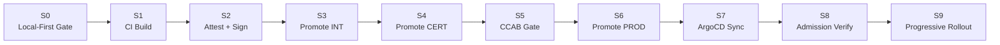
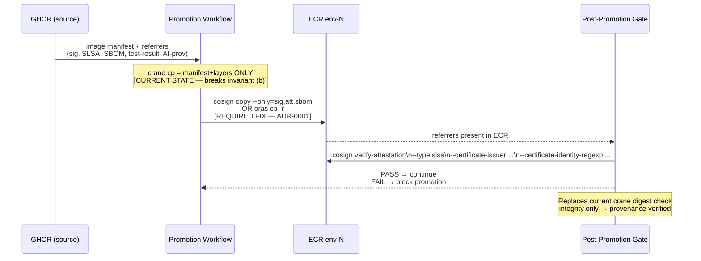

# Promotion + Attestation Pipeline Specification

**Document type:** Implementation-Actionable Derived Artifact (corpus-internal)
**Research topic:** `enterprise-sdlc-gitflow-attestation`
**Grounded in:** SLSA v1.1, in-toto, Sigstore, OCI 1.1 referrers, Kyverno; field-validated against one examined production implementation (an anonymized reference implementation, §16 of RESEARCH-REPORT.md)
**Date:** 2026-06-01
**Status:** DRAFT — encodes design decisions ADR-0001–0063

> Finding IDs (`f_<dim>_<n>`) reference `reports/enterprise-sdlc-gitflow-attestation/findings_*.json`.
> External/value-add outputs derived from this spec must strip IDs and re-cite primary sources
> per repo CLAUDE.md.

---

## 1. Overview and the Promotion Invariant

### 1.1 Promotion Invariant

#### A digest may enter environment N+1 only if all three conditions hold simultaneously

| Condition | What it means | Common failure mode |
| --- | --- | --- |
| **(a) Byte-identical to N** | The sha256 digest at the ECR destination equals the digest that passed N — verified by `cosign verify` or equivalent, not by tag lookup | `crane digest` checks integrity but not provenance (f_artifact_attestation_promotion_7) |
| **(b) Attestations travel with it and re-verify at N+1** | SLSA provenance, SBOM, Grype scan result, in-toto test-result, and AI-provenance predicates are present in the ECR target registry and pass `cosign verify-attestation` before pods are admitted | `crane cp` orphans all OCI referrers (f_artifact_attestation_promotion_3); post-promotion gate left as bare digest check |
| **(c) A change record authorizes the move** | A structured promotion Issue (§4.4 payload) or JIRA CCAB ticket is open, references the exact digest, and carries the required approvals before the promotion workflow executes | CAB workflows commonly require digest + SBOM/SLSA links without verifying those links cryptographically at the gate (f_artifact_attestation_promotion_11) |

Condition (b) is the primary gap: **the attestation chain breaks at every copy-by-digest registry boundary that is not referrer-aware** (f_artifact_attestation_promotion_2,3). Closing it is Phase 0 of the implementation roadmap.

### 1.2 Canonical Identity

The container image sha256 digest is the only promotion key (design principle P1). Tags are informational and immutable; they are never the basis for a gate decision. GHCR is the source-of-truth registry; ECR is the runtime mirror per environment (f_artifact_attestation_promotion_15).

### 1.3 Signing Ecosystem — Two Clean Paths

> **Critical distinction:** these are NOT interchangeable. Mixing verifiers breaks the chain.

| Path | Image signature | Attestation predicates | Verify tool | Carry on promotion |
| --- | --- | --- | --- | --- |
| **Path A — cosign keyless (default)** | Sigstore DSSE, Fulcio cert, Rekor v2 log | SLSA DSSE, CycloneDX SBOM, in-toto, AI-provenance — all DSSE envelopes | `cosign verify` / `cosign verify-attestation` | `cosign copy --only=sig,att,sbom` or `oras cp -r` |
| **Path B — ECR Managed Signing (alternative)** | AWS Signer + Notation (Notary Project format) | SLSA/SBOM **attestation predicates remain sigstore DSSE regardless** | `notation verify` / Ratify (Kyverno notary verifier) for the signature; `cosign verify-attestation` for attestation predicates | ECR cross-region referrer replication — native, zero friction |

**Recommendation:** Path A (cosign keyless) is the baseline because GitHub `actions/attest-build-provenance` emits sigstore DSSE predicates unconditionally. Path B's ECR managed signing is preferred for the image signature only on AWS-native deployments because it eliminates client key material and replicates referrers natively; however, attestation predicate verification (`cosign verify-attestation`) applies in both paths. The Kyverno policy in §4 is written for Path A; substitute `notary` verifier block for the signature check only if Path B is chosen.

---

## 2. Stage-by-Stage Specification

### Stage Map



All gate failures return to DEV. No in-place fixes in INT, CERT, or PROD (f_cicd_promotion_pipeline_1).

### Stage → interface contract map

Each stage *implements* one or more recipient-independent interface contracts defined in
[`INTERFACE-CONTRACTS.md`](INTERFACE-CONTRACTS.md). A recipient that implements these stages can be assessed for
conformance with the probes under `conformance/` — independent of this corpus.

| Stage | Implements | Conformance probe |
| --- | --- | --- |
| S2 Attest + Sign | I1 Attestation-Production | `conformance/verify-attestation-production.sh` |
| S3 / S4 / S6 Promote | I2 Promotion-Verification | `conformance/verify-promotion.sh` |
| S4 CERT (DAST portion) | I8 DAST-Evidence | `conformance/verify-dast-evidence.sh` |
| S8 Admission Verify | I4 Policy-Gate | `conformance/verify-policy-gate.sh` |
| (publish/release) | I3 Release-Attestation, I7 Polyglot-Attestation | `conformance/verify-release-attestation.sh`, `conformance/verify-polyglot.sh` |
| (runtime, cross-cutting) | I5 Quality-Event, I6 Log-Contract | `conformance/verify-quality-event.sh`, `conformance/verify-log-contract.sh` |

---

### S0 — Local-First Gate

| Field | Value |
| --- | --- |
| **Trigger** | Developer runs `terragrunt apply` locally or pre-commit hooks fire on `git commit` |
| **Inputs** | Source tree, LocalStack instance, `local_validation_confirmed` flag |
| **Actions** | pre-commit: lint, format, secret-scan, git-creep AI trailer injection; Terraform null_resource gate checks `local_validation_confirmed=true`; LocalStack smoke tests; Checkov 3.2.497+ IaC scan |
| **Attestations produced** | None (evidence is unsigned at this stage — gap closed in S2 via in-toto test-result predicate) |
| **Attestations consumed** | None |
| **Gate / exit criteria** | `local_validation_confirmed=true` in Terraform state; pre-commit returns 0; Checkov 0 critical/high |
| **Failure behavior** | null_resource fails apply; developer fixes in local environment; no cloud resource touched |

**Note:** Any deprecated IaC scanner (`tfsec` or similar) must be replaced — **excluding** `trivy-action` (CVE-2026-33634, CRITICAL; f_supply_chain_security_sbom tooling warning; ADR-0008 mandates Syft+Grype and digest-pinned security tooling).

---

### S1 — CI Build

| Field | Value |
| --- | --- |
| **Trigger** | Merge to `main`; `push` event on `main` branch in GitHub Actions |
| **Inputs** | Source commit SHA, Dockerfile, test suite |
| **Actions** | Checkout; run unit tests; `docker build`; push to GHCR with `:<sha>` tag; capture sha256 digest output |
| **Attestations produced** | None yet (build stage is the *subject*; attestation is produced in S2) |
| **Attestations consumed** | None |
| **Gate / exit criteria** | Image pushed to GHCR; `DIGEST=sha256:...` available as workflow output; unit tests pass; `image_digest` passed forward as the only promotion key |
| **Failure behavior** | Workflow fails; no promotion triggered; developer fixes in feature branch |

**Runner note:** Where the EKS API is private-only, self-hosted runners on EC2 ASG in a private VPC are required. Prefer ARC ephemeral runner scale sets for clean-slate-per-job security (f_cicd_promotion_pipeline_5); if retaining EC2 ASG, rotate AMIs on a schedule.

---

### S2 — Attest + Sign (the attestation production stage)

| Field | Value |
| --- | --- |
| **Trigger** | Successful completion of S1; called as an **isolated reusable workflow** (required for SLSA L3) |
| **Inputs** | `image_digest` (sha256) from S1; GitHub OIDC token (`id-token: write`) |
| **Actions** | (1) `actions/attest-build-provenance` in isolated reusable workflow → SLSA v1.0 Build L3 provenance DSSE; (2) `syft` generates CycloneDX 1.6 SBOM → `cosign attest` attaches to digest; (3) Grype scans SBOM → result cosign-attested with `in-toto` vuln-scan predicate; (4) `cosign attest` attaches in-toto test-result predicate (PASSED/WARNED/FAILED) for unit + IaC tests from S0/S1; (5) `cosign attest` attaches AI-provenance predicate (git-creep 18-key trailer schema) if commit carries `AI-Tool` trailers (ADR-0005); (6) `cosign sign` on the digest (Path A: keyless Fulcio/Rekor v2; Path B: `notation sign` for image signature only) |
| **Attestations produced** | SLSA v1.0 L3 provenance (`https://slsa.dev/provenance/v1`); CycloneDX 1.6 SBOM (`https://cyclonedx.org/bom`); Grype vuln scan (`https://in-toto.io/attestation/vulns`); in-toto test-result v0.1 (`https://in-toto.io/attestation/test-result/v0.1`); AI-provenance predicate (vendor-namespaced, git-creep schema) |
| **Attestations consumed** | None |
| **Gate / exit criteria** | All five predicate types present in GHCR OCI referrers store for `sha256:<digest>`; `cosign verify-attestation --type slsa` exits 0 against GHCR before INT promotion begins |
| **Failure behavior** | Reusable workflow fails; promotion blocked; digest remains in GHCR unsigned; developer investigates signing infrastructure |

**ADR refs:** ADR-0002 (SLSA L3), ADR-0003 (CycloneDX 1.6), ADR-0005 (AI-provenance), ADR-0008 (Syft+Grype, NOT trivy-action).

**SLSA L3 isolation requirement:** `actions/attest-build-provenance` gives L2 by default; L3 additionally requires provenance generation in a **separately-hosted reusable workflow** the developer cannot influence. Keyless OIDC ephemeral credentials already satisfy key-isolation; the remaining gap is the isolated workflow pattern (f_artifact_attestation_promotion_13, medium-confidence — confirm with GitHub SLSA L3 guide before declaring L3 in a change record).

**Tooling constraint (ADR-0008):** `trivy-action` was supply-chain-compromised March 2026 (CVE-2026-33634, CRITICAL — 76/77 tags poisoned, exfiltrating cloud credentials from CI). Standardize on **Syft** (SBOM) + **Grype** (scan). Pin all security tooling by digest, never mutable tag.

**Rekor v2 note:** cosign >= 2.6.0 required; Rekor v2 GA (Oct 2025) introduces annual shard rotation — hardcoded Rekor URLs break on older clients. Require `cosign version` >= 2.6.0 + `cosign initialize` (TUF root) in all workflows.

---

### S3 — Promote to INT

| Field | Value |
| --- | --- |
| **Trigger** | GitHub Actions `promote-int` reusable workflow called with `image_digest` input; `deploy/int` label applied to the structured promotion Issue (§4.4 payload) |
| **Inputs** | `image_digest` (sha256 from S1); GHCR source ref; ECR INT target |
| **Actions** | (1) `cosign copy --only=sig,att,sbom ghcr.io/ORG/APP@<digest> <ecr-int>/APP:<digest-tag>` — carries all OCI referrers; OR `oras cp -r` (referrer-aware); (2) Post-copy gate: `cosign verify-attestation --type slsa <ecr-int>/APP@<digest>` — verifies SLSA predicate present and valid **in ECR**, not just GHCR; (3) ArgoCD non-prod auto-sync updates INT cluster manifest to pin digest |
| **Attestations produced** | Digest-verification record (GitHub deployment record API, 2026-01-20 storage records schema) |
| **Attestations consumed** | SLSA provenance + image signature from GHCR (verified post-copy in ECR) |
| **Gate / exit criteria** | `cosign verify-attestation` exits 0 on ECR INT URI; ArgoCD INT app status = `Synced+Healthy`; smoke tests pass |
| **Failure behavior** | Promotion workflow fails; no ECR tag applied; ArgoCD keeps prior digest; failure comment posted to promotion Issue thread |

**ADR refs:** ADR-0001 (carry referrers — closes crane-cp orphaning gap).

**The crane-cp gap (ADR-0001):** A naive `crane cp <src>@<digest> <dst>:<tag>` + `crane digest` verify copies manifest+layers only — OCI referrers (signatures, SLSA, SBOM) are **not carried** (f_artifact_attestation_promotion_3). Fix options in preference order:

1. ECR managed signing + referrer-aware cross-region replication (Path B — signature only; DSSE predicates still need `cosign copy`)
2. `cosign copy --only=sig,att,sbom` as explicit post-crane-cp step (Path A)
3. `oras cp -r` replacing `crane cp` entirely (referrer-aware, works for both paths)

Replace the post-promotion `crane digest` gate with `cosign verify-attestation` — the former verifies integrity only; the latter verifies provenance.

---

### S4 — Promote to CERT

| Field | Value |
| --- | --- |
| **Trigger** | Gate 2 passes (INT integration + API contract tests pass, ~30 min); `deploy/cert` label on promotion Issue |
| **Inputs** | Same `image_digest` as S3; ECR INT source; ECR CERT target |
| **Actions** | `cosign copy --only=sig,att,sbom <ecr-int>/APP@<digest> <ecr-cert>/APP:<digest-tag>`; post-copy `cosign verify-attestation`; ArgoCD non-prod auto-sync to CERT; parallel validation block (Performance/Load, DAST+Pen, SOC2/PCI compliance, UAT QA sign-off — ~4 hours); Grype rescan against latest CVE DB (not just build-time scan) |
| **Attestations produced** | Digest-verification record; CERT Grype rescan result attested with `cosign attest` (freshness extension — see §3) |
| **Attestations consumed** | SLSA provenance + SBOM + build-time Grype scan from S2 |
| **Gate / exit criteria** | All four cert validation domains pass; no critical/high CVEs in rescan; `cosign verify-attestation` exits 0 on ECR CERT URI; Gate 3 opens to CCAB review |
| **Failure behavior** | Failure returns to DEV; cert environments rolled back to prior digest via Argo Rollouts `abort` or ArgoCD history revert; artifacts collected for remediation ticket |

**ADR refs:** f_cicd_promotion_pipeline_16 (4-hour cert block detail).
**Rescan note:** build-time Grype scan captures CVEs as of build date; new CVEs post-promotion go undetected without a rescan schedule. Rescan at CERT with fresh Grype DB and re-attest the result.
**DAST evidence (interface I8).** The "DAST+Pen" item is operationalized as the **DAST-Evidence** contract: the scan exports a machine-readable result, wraps it as an in-toto test-result attestation bound to the image digest, and the gate verifies a `result == "PASSED"` attestation (fail closed). Worked reference implementation: [`handbook/how-to/attest-dast-results.md`](handbook/how-to/attest-dast-results.md); contract: [`INTERFACE-CONTRACTS.md`](INTERFACE-CONTRACTS.md) §I8; probe: `conformance/verify-dast-evidence.sh`.

---

### S5 — CCAB Gate (change record, not an environment)

| Field | Value |
| --- | --- |
| **Trigger** | All CERT validation passes; the structured promotion Issue (§4.4 payload) receives `deploy/prod` label |
| **Inputs** | Promotion Issue (§4.4 YAML payload); CERT gate evidence; digest + SBOM/SLSA links |
| **Actions** | Auto-create JIRA CCAB ticket with: release tag, commit SHA, `image_digest` (sha256), SBOM OCI ref, SLSA attestation URL, cert evidence links, change window, risk assessment; require two named approvals (Platform + Security); CCAB ticket status must reach `Approved` before S6 is permitted |
| **Attestations produced** | CCAB ticket = canonical change record (satisfies SOC2 CC8.1, ISO 27001 A.8.32) |
| **Attestations consumed** | SLSA provenance link, SBOM OCI ref (for CCAB evidence package) |
| **Gate / exit criteria** | CCAB ticket `status=Approved` + change window confirmed; two named approvals recorded in JIRA; GitHub Environment protection rules for `production` clear (blocking OIDC token issuance) |
| **Failure behavior** | CCAB rejection documented in ticket; promotion Issue updated; change returns to DEV for remediation; CCAB reviewer feedback links to promotion Issue thread |

**ADR refs:** f_artifact_attestation_promotion_11 (CAB workflow), f_cicd_promotion_pipeline_3 (GitHub Environment gates OIDC issuance — CCAB approval enforced in-platform, not by convention).

**DORA note:** CCAB gate is ~84% of total lead time (f_dora_metrics_2). Instrument `gate_ccab_duration_seconds` to separate approval latency from automation time. This is the single biggest lead-time lever.

#### S5 Acceptance Criteria — the production-readiness checklist

The CCAB ticket is **approved when the change record demonstrates each criterion below**, benchmarked against
Google SRE PRR, AWS Well-Architected ORR, and ITIL 4 change enablement (full derivation + primary citations in
`RESEARCH-REPORT.md` §24). **The intent is that all but the human approval are satisfied automatically by
upstream gate evidence** — per DORA, "no evidence … that a more formal, external review process was associated
with lower change fail rates"; the control is peer review + automation, not a board meeting
(<https://dora.dev/capabilities/streamlining-change-approval/>; f_change_admission_board_4). The ticket links the
evidence; the human approval confirms it, it does not re-run it.

| # | Acceptance criterion | Satisfied by (auto-evidence) | Stage |
| --- | --- | --- | --- |
| 1 | **Security** — signed/attested artifact (SLSA Build ≥L2, current spec **v1.2**), SBOM attached, non-author review | `cosign verify-attestation`, SBOM OCI ref, CODEOWNERS review | S2, S0 |
| 2 | **Quality** — automated tests/gates green; auto-rollback on SLA breach configured | CERT evidence; Argo Rollouts analysis (§S9) | S4, S9 |
| 3 | **Observability** — SLO/SLI alarms live, dashboards present, gameday-verified monitoring | OTel signals (RESEARCH-REPORT §23 log-contract); event-management ORR set | S9 |
| 4 | **Architecture** — blast-radius/failure model + dependency retry/back-off reviewed | ADR / design review on the change | S0 |
| 5 | **Rollback / backout** — tested reverse path exists | three rollback layers (RESEARCH-REPORT §12, §14); restore-drill record | S9, runbook |
| 6 | **Risk & business-impact** — explicit risk rating in the ticket | `risk_assessment` field (S5 payload) | S5 |
| 7 | **Capacity / load** — load-test plan exercised | ORR load-test evidence | CERT |
| 8 | **Dependency / integration-impact** — customer-impacting API + dependency table | ORR architecture answers | S0 |
| 9 | **On-call / runbook readiness** — runbook exists, on-call engaged at window | `HOTFIX-RUNBOOK.md`; on-call schedule | runbook |
| 10 | **DR / data-backup** — RTO/RPO defined and practiced (AWS REL13-BP01) | restore-drill record | runbook |
| 11 | **Customer communications** — release notes + advance maintenance notice | release-notes artifact; status-page plan | S6 |
| 12 | **Release timing** — change window confirmed; freeze/blackout respected; no collision | `change_window` field; change calendar | S5 |
| 13 | **Stakeholder sign-off** — named change authority (Platform + Security) approves | two named JIRA approvals | S5 |
| 14 | **Post-implementation review** — PIR scheduled; change-success verified after deploy | PIR ticket linkage | post-S9 |

**Emergency-change path.** Urgent changes take the **hotfix runbook** (`HOTFIX-RUNBOOK.md`) + a break-glass approval, *not* a
convened board. Note "eCAB" is ITIL **v3** vocabulary; ITIL 4 handles emergency changes as a change type under
*change enablement* with a decentralized *change authority* (f_change_admission_board_18). The expedited path
still produces the same change record retrospectively for SOC2 CC7.3 / CC8.1 evidence.

---

### S6 — Promote to PROD

| Field | Value |
| --- | --- |
| **Trigger** | CCAB approved + change window confirmed; `production` GitHub Environment protection rules clear; `promote-prod` reusable workflow dispatched |
| **Inputs** | `image_digest` (same sha256 as S1–S5); ECR CERT source; ECR PROD target; CCAB ticket ID |
| **Actions** | `cosign copy --only=sig,att,sbom <ecr-cert>/APP@<digest> <ecr-prod>/APP:<digest-tag>`; post-copy `cosign verify-attestation --type slsa`; write digest to the GitOps repo (PR + CODEOWNERS approval); CCAB ticket ID recorded in deployment record |
| **Attestations produced** | Digest-verification record; GitHub deployment record (`deployment_records` API, storage record documenting ECR PROD location) |
| **Attestations consumed** | All five predicates from S2, re-verified in ECR PROD |
| **Gate / exit criteria** | `cosign verify-attestation` exits 0 on ECR PROD URI; GitOps PR merged to the GitOps repo; Argo CD PROD app status = `Synced` (pending rollout) |
| **Failure behavior** | Promotion workflow fails; no GitOps commit; PROD cluster unchanged; CCAB ticket updated with failure; incident process triggered if PROD is in degraded state |

**ADR refs:** ADR-0001 (referrer-aware copy applied).

---

### S7 — GitOps Sync (Argo CD)

| Field | Value |
| --- | --- |
| **Trigger** | GitOps PR merged to the GitOps repo; Argo CD PROD detects desired-state diff |
| **Inputs** | Kubernetes manifest with `image: <ecr-prod>/APP@sha256:<digest>` pinned |
| **Actions** | Argo CD PROD (manual sync, sourceRepos restricted to the prod GitOps source repos) syncs application; passes manifest to Kubernetes admission |
| **Attestations produced** | Argo CD sync history record (SOC2 CC8.3 evidence) |
| **Attestations consumed** | None at this layer (admission verification happens in S8) |
| **Gate / exit criteria** | Argo CD app transitions to `Synced`; pods reach `Running` after S8 admission |
| **Failure behavior** | Argo CD sync error logged; prior desired-state restored by reverting GitOps PR; on-call paged if PROD degraded |

**Design refs:** §12 of RESEARCH-REPORT.md (separate prod GitOps instance; manual sync; source repo allow-list).

---

### S8 — Admission Verification (Kyverno)

| Field | Value |
| --- | --- |
| **Trigger** | Kubernetes pod CREATE/UPDATE webhook (every pod scheduled from GitOps sync) |
| **Inputs** | Pod spec with image reference `<ecr-prod>/APP@sha256:<digest>` |
| **Actions** | Kyverno `ImageValidatingPolicy` intercepts pod; resolves tag to digest (`mutateDigest: true`); calls `cosign verify-attestation` against ECR PROD referrers store; checks: OIDC issuer = `https://token.actions.githubusercontent.com`, OIDC subject = exact `…/.github/workflows/attest.yml@refs/heads/main`, SLSA predicate type = `https://slsa.dev/provenance/v1`; `validationActions: [Deny]`, `failurePolicy: Fail` |
| **Attestations produced** | None (verification only) |
| **Attestations consumed** | Image signature (cosign) + SLSA provenance attestation from ECR PROD referrers |
| **Gate / exit criteria** | Kyverno webhook returns `Allowed`; pod admitted |
| **Failure behavior** | Kyverno returns `Deny` with error message; pod rejected; existing pods continue serving; alert fired; root-cause is attestation absence/mismatch in ECR PROD — trace to S6 attestation carry step |

**ADR refs:** ADR-0004 (Kyverno admission-time attestation verification). Note: OPA Gatekeeper, if present for pod security standards, is supplemented — not replaced — by Kyverno's `ImageValidatingPolicy`; the two policies serve different purposes.

**Rollout sequence:** start Kyverno policy in `Audit` mode (logs but does not deny) across all envs; validate no false positives over one sprint; flip to `Enforce` (`validationActions: [Deny]`, `failurePolicy: Fail`) in non-prod first, then PROD (f_policy_compliance_gates_2).

---

### S9 — Progressive Rollout (Argo Rollouts)

| Field | Value |
| --- | --- |
| **Trigger** | Argo CD PROD sync complete; Rollout controller detects new digest on stable ReplicaSet |
| **Inputs** | Rollout resource with canary strategy; AnalysisTemplate (Prometheus or CloudWatch via IRSA) |
| **Actions** | Canary progression: 5%→10%→25%→50%→100% with metric gates at each step; AnalysisRun evaluates error rate (<5%) and P99 latency (<500ms); `consecutiveSuccessLimit` configured to tolerate noisy early canary (Argo Rollouts v1.8+) |
| **Attestations produced** | DORA `promote-prod workflow_run conclusion=success` event → deployment frequency + lead time (f_dora_metrics_3) |
| **Attestations consumed** | None (digest already admitted in S8) |
| **Gate / exit criteria** | Rollout reaches 100% canary weight + AnalysisRun `Successful`; DORA deployment event emitted |
| **Failure behavior** | AnalysisRun triggers auto-abort; Argo Rollouts restores stable ReplicaSet (sub-2-min RTO — the *prior* attested digest); on-call paged via PagerDuty; FDRT clock starts |

**ADR refs:** f_progressive_delivery_rollout_1,4 (abort vs undo, IRSA AnalysisTemplate).

**Rollback = re-point, not rebuild:** The prior stable digest is already in ECR PROD with its full attestation graph. `kubectl argo rollouts abort` restores it instantly. The digest is already verified — no re-attestation needed. This is the DORA-elite MTTR property: rollback is mechanically identical to forward promotion but zero-wait (f_hotfix_incident_rollback_1).

---

## 3. The Attestation Graph

### 3.1 OCI Referrers on a Digest

After S2 completes, the digest in GHCR has the following referrer tree:

```text
sha256:<digest>  (image manifest)
├── cosign signature (Sigstore DSSE, Fulcio cert, Rekor v2 entry)
├── SLSA v1.0 Build L3 provenance  predicateType: https://slsa.dev/provenance/v1
├── CycloneDX 1.6 SBOM             predicateType: https://cyclonedx.org/bom
├── Grype vuln scan                predicateType: https://in-toto.io/attestation/vulns
├── in-toto test-result v0.1       predicateType: https://in-toto.io/attestation/test-result/v0.1
└── AI-provenance                  predicateType: vendor/git-creep/v1 (SLSA externalParameters, namespaced)
```

All attestation predicates are stored as OCI referrers using the `subject` field pointing to the image manifest (OCI 1.1 referrers API, supported natively by ECR since June 2024, f_artifact_attestation_promotion_12).

### 3.2 Carrying the Graph on Promotion



### 3.3 Referrer Carry Mechanism — Decision Matrix

| Mechanism | Carries image sig | Carries DSSE predicates | Native ECR replication | Recommended for |
| --- | --- | --- | --- | --- |
| `crane cp` (current) | No | No | No | **Do not use for attestation-bearing promotions** |
| `cosign copy --only=sig,att,sbom` | Yes (sigstore) | Yes | No — explicit copy per env | Path A (sigstore keyless) |
| `oras cp -r` | Yes (OCI referrers) | Yes | No — explicit copy per env | Either path; most portable |
| ECR managed signing + ECR replication | Yes (Notation) | Not applicable (DSSE predicates must still be copied via cosign copy) | Yes (signature only) | Path B (AWS-native, signature layer only) |

**The critical nuance (Path B):** ECR managed signing (AWS Signer + Notation) replicates the Notation-format image *signature* natively via cross-region replication. However, the SLSA provenance, SBOM, test-result, and AI-provenance predicates are **sigstore DSSE envelopes regardless of which path is chosen** (they originate from `actions/attest-build-provenance` and `cosign attest`). Those DSSE predicates must always be carried with `cosign copy --only=att` or `oras cp -r`. Verify the image signature with `notation verify` / Ratify; verify attestation predicates with `cosign verify-attestation`.

### 3.4 Freshness and Re-attestation

The Grype scan predicate captures CVE state as of build time. As the CVE DB evolves, a digest already in ECR PROD may be vulnerable to post-build CVEs. Manage freshness:

- Re-run Grype against the ECR PROD digest on a schedule (daily/weekly)
- If new critical/high CVEs found: cosign-attest a new vuln-scan predicate with `fetched_at` timestamp and `result: FAIL`
- Kyverno or OPA Rego can enforce a `max-age` policy on vuln-scan predicates using Rekor `buildTimestamp`
- The EU CRA vulnerability-reporting mandate (binding Sept 2026) will likely require a documented rescan cadence

---

## 4. Reference YAML Snippets (Illustrative)

All snippets are structurally grounded in findings; field names are faithful to the relevant specs. Labels such as `YOUR_ORG`, `YOUR_APP`, `YOUR_WORKFLOW_REF` are placeholders.

### 4.1 Reusable Build + Attest Workflow (SLSA L3 isolated pattern)

```yaml
# .github/workflows/attest.yml
# Called as a reusable workflow from the build workflow.
# Running in THIS separate repo/workflow achieves the SLSA L3
# provenance-isolation requirement: the caller's build job cannot
# tamper with the provenance produced here.
name: Attest (SLSA L3 isolated signer)

on:
  workflow_call:
    inputs:
      image_digest:
        required: true
        type: string   # sha256:abc123...
      image_ref:
        required: true
        type: string   # ghcr.io/YOUR_ORG/YOUR_APP

    outputs:
      attestation_id:
        description: "GitHub attestation ID"
        value: ${{ jobs.attest.outputs.attestation_id }}

permissions:
  id-token: write        # required for OIDC → Fulcio cert issuance
  attestations: write    # required for actions/attest-build-provenance
  contents: read
  packages: read

jobs:
  attest:
    runs-on: ubuntu-latest  # or self-hosted VPC runner where EKS API is private-only
    outputs:
      attestation_id: ${{ steps.attest-provenance.outputs.attestation-id }}

    steps:
      - name: Install cosign (>= 2.6.0 — Rekor v2 shard rotation)
        uses: sigstore/cosign-installer@v3
        with:
          cosign-release: v2.6.0   # pin to digest in production

      - name: Install Syft (SBOM) — pinned by digest (ADR-0008)
        run: |
          curl -sSfL https://raw.githubusercontent.com/anchore/syft/main/install.sh \
            | sh -s -- -b /usr/local/bin v1.5.0
          # TODO: replace URL with digest-pinned download in production

      - name: Install Grype (vuln scan) — pinned by digest (ADR-0008)
        run: |
          curl -sSfL https://raw.githubusercontent.com/anchore/grype/main/install.sh \
            | sh -s -- -b /usr/local/bin v0.85.0

      - name: Generate SLSA L3 build provenance
        id: attest-provenance
        uses: actions/attest-build-provenance@v2
        with:
          subject-name: ${{ inputs.image_ref }}
          subject-digest: ${{ inputs.image_digest }}
          # Private repo: uses GitHub's private Sigstore instance (no public Rekor exposure)
          # Public repo: uses public-good Sigstore

      - name: Generate CycloneDX 1.6 SBOM (Syft)
        run: |
          syft ${{ inputs.image_ref }}@${{ inputs.image_digest }} \
            -o cyclonedx-json@1.6 \
            --file sbom.cdx.json

      - name: Attest SBOM to digest (cosign keyless)
        run: |
          cosign attest --yes \
            --predicate sbom.cdx.json \
            --type https://cyclonedx.org/bom \
            ${{ inputs.image_ref }}@${{ inputs.image_digest }}

      - name: Grype vulnerability scan
        run: |
          grype sbom:sbom.cdx.json \
            --fail-on critical \
            --output json \
            --file grype-results.json

      - name: Attest Grype scan result
        run: |
          cosign attest --yes \
            --predicate grype-results.json \
            --type https://in-toto.io/attestation/vulns \
            ${{ inputs.image_ref }}@${{ inputs.image_digest }}

      # AI-provenance attest (ADR-0005) — conditional on commit trailers
      - name: Attest AI provenance (if AI trailers present)
        env:
          AI_PROVENANCE_JSON: ${{ toJson(env.AI_PROVENANCE) }}  # set by caller
        run: |
          if [ -n "$AI_PROVENANCE_JSON" ]; then
            cosign attest --yes \
              --predicate ai-provenance.json \
              --type vendor/git-creep/v1 \
              ${{ inputs.image_ref }}@${{ inputs.image_digest }}
          fi

      - name: Verify all attestations present in GHCR
        run: |
          cosign verify-attestation \
            --type https://slsa.dev/provenance/v1 \
            --certificate-issuer https://token.actions.githubusercontent.com \
            --certificate-identity-regexp "https://github.com/${{ github.repository_owner }}/.github/workflows/attest.yml@refs/heads/main" \
            ${{ inputs.image_ref }}@${{ inputs.image_digest }}
```

### 4.2 Attestation-Preserving Promotion Step (ADR-0001 fix)

```yaml
# Replaces: crane cp <ghcr>@<digest> <ecr>:<tag>
# Rationale: cosign copy carries OCI referrers; crane cp does not.

- name: Promote image with attestations (cosign copy)
  env:
    SRC: ghcr.io/${{ env.ORG }}/${{ env.APP }}@${{ inputs.image_digest }}
    DST: ${{ env.ECR_REGISTRY }}/${{ env.APP }}:${{ env.ENV_TAG }}
  run: |
    cosign copy \
      --only=sig,att,sbom \
      $SRC $DST

- name: Post-promotion attestation gate (replaces crane digest check)
  run: |
    cosign verify-attestation \
      --type https://slsa.dev/provenance/v1 \
      --certificate-issuer https://token.actions.githubusercontent.com \
      --certificate-identity-regexp "https://github.com/${{ env.ORG }}/.github/workflows/attest.yml@refs/heads/main" \
      ${{ env.ECR_REGISTRY }}/${{ env.APP }}@${{ inputs.image_digest }}
    echo "ATTESTATION_VERIFIED=true" >> $GITHUB_ENV
```

### 4.3 Kyverno ImageValidatingPolicy (Admission Gate — ADR-0004)

```yaml
# cluster-policy-verify-slsa.yaml
# Applies to all namespaces; start in Audit mode, promote to Enforce after validation sprint.
apiVersion: kyverno.io/v1alpha1
kind: ImageValidatingPolicy
metadata:
  name: verify-slsa-provenance
  annotations:
    policies.kyverno.io/title: Verify SLSA L3 Provenance at Admission
    policies.kyverno.io/description: >
      Blocks pods whose images lack valid SLSA v1.0 provenance from the
      authorized GitHub Actions workflow. Satisfies ADR-0004 / SOC2 CC7.2.
spec:
  # Start: validationActions: [Audit]  — after validation sprint flip to Deny
  validationActions: [Deny]
  failurePolicy: Fail
  matchConstraints:
    resourceRules:
      - apiGroups: [""]
        apiVersions: ["v1"]
        operations: ["CREATE", "UPDATE"]
        resources: ["pods"]
  matchImageReferences:
    - glob: "${{ env.ECR_REGISTRY }}/*"   # scope to ECR images only

  attestors:
    - attestations:
        - type: cosign
          keyless:
            issuer: https://token.actions.githubusercontent.com
            subject:
              # Exact workflow ref for provenance isolation (SLSA L3)
              match: "https://github.com/YOUR_ORG/.github/workflows/attest.yml@refs/heads/main"
          attestations:
            - predicateType: https://slsa.dev/provenance/v1
              conditions:
                # CEL expression: buildDefinition.buildType must be GitHub Actions
                - expression: >
                    has(attestation.predicate.buildDefinition) &&
                    attestation.predicate.buildDefinition.buildType ==
                      'https://slsa-framework.github.io/github-actions-buildtypes/workflow/v1'
  # mutateDigest: true (default) — resolves tag refs to digests at admission
  # verifyDigest: true (default) — verifies resolved digest matches manifest
```

### 4.3.1 Other Policy-Gate engines (interface I4)

Kyverno (§4.3) is one implementation of the engine-agnostic **Policy-Gate** contract (`INTERFACE-CONTRACTS.md`
§I4). The same contract — deny-by-default, pin predicate type + signer identity, policy-as-code — is implemented
by two other engines, with full worked examples:

- **Pre-flight / CI-time (Conftest + OPA bundles):**
  [`handbook/how-to/author-conftest-and-opa-policies.md`](handbook/how-to/author-conftest-and-opa-policies.md) —
  a Rego `deny` that rejects SLSA provenance unless `predicate.runDetails.builder.id` matches a pinned reusable
  workflow, runnable via `conftest test` or served as a signed OPA bundle decision service.
- **Admission-time (Sigstore policy-controller):**
  [`handbook/how-to/configure-sigstore-policy-controller.md`](handbook/how-to/configure-sigstore-policy-controller.md)
  — a `ClusterImagePolicy` requiring keyless signatures + a `slsaprovenance1` attestation, promoted `warn`→`enforce`.

Conformance probe for any engine: `conformance/verify-policy-gate.sh` (admits an attested digest, denies a
non-attested one).

### 4.4 Issue-Driven Promotion YAML Payload

```yaml
# Promotion Issue body — structured YAML
# Label trigger: deploy/prod → runs issue-promotion.yml → promote-prod.yml
promotion:
  version: "1.0"
  change_record:
    jira_ccab: "CCAB-2847"            # required before deploy/prod label
    change_window: "2026-06-04T14:00:00Z/2026-06-04T18:00:00Z"  # Tue-Thu 10am-2pm ET
    approvers:
      - platform: "alice@example.com"
      - security: "bob@example.com"
  services:
    - name: learning-api
      image_ref: "123456789.dkr.ecr.us-east-1.amazonaws.com/learning-api"
      image_digest: "sha256:abc123def456..."   # the only promotion key (design principle P1)
      environment: production
      rollback_digest: "sha256:previous987..."  # prior prod digest for rapid rollback
  attestation_links:
    slsa_provenance: "https://github.com/YOUR_ORG/YOUR_APP/attestations/..."
    sbom_oci_ref: "123456789.dkr.ecr.us-east-1.amazonaws.com/learning-api@sha256:sbom..."
    grype_scan: "https://github.com/YOUR_ORG/YOUR_APP/attestations/..."
  ai_provenance:
    present: true                      # AI-provenance trailer detected
    authoring_mode: "autonomous-workflow"
    attestation_method: "github-oidc"
```

---

## 5. Pipeline Stage × DORA Event × Compliance Control

| Stage | DORA event emitted | DORA metric | Compliance control satisfied |
| --- | --- | --- | --- |
| S0 Local-First Gate | None (pre-pipeline) | Feeds LT clock (commit timestamp) | NIST SSDF RV.1.1 — shift-left validation |
| S1 CI Build | None | Feeds LT | SOC2 CC8.1 — change management (PR + 2 approvals + branch protection) |
| S2 Attest + Sign | None | Feeds LT | SLSA L3 (NIST SSDF SA.1.3); NIST SP 800-218 Build provenance; EO 14028 §4(e)(ix) |
| S3 Promote INT | `workflow_run` (non-prod — do NOT count as deployment) | Feeds LT; n/a for DF | SOC2 CC8.1 (automated gate evidence); SLSA carry |
| S4 Promote CERT | None (same) | Feeds LT; n/a for DF | SOC2 CC8.1; NIST SSDF DS.1.1 (vuln scan before prod); EU CRA Art. 13 vuln disclosure readiness |
| S5 CCAB Gate | None (approval latency recorded as `gate_ccab_duration_seconds`) | Feeds LT (~84% of total) | SOC2 CC8.1 (change record + dual approval); ISO 27001 A.8.32; PCI DSS Req 6.4.6 |
| S6 Promote PROD | `promote-prod workflow_run conclusion=success` — **DF numerator, LT end** | Deployment Frequency; Lead Time for Change | SOC2 CC8.1 + CC7.2 (auditable prod change); SLSA L3 provenance verified; NIST SSDF DS.3.1 |
| S7 ArgoCD Sync | `argocd_app_sync_total{phase=Succeeded,env=prod}` — cross-validate DF | DF cross-check | SOC2 CC8.3 (Argo CD sync history = change evidence); ISO 27001 A.8.19 |
| S8 Admission Verify | None | n/a | SLSA L3 enforcement at runtime; NIST SSDF DS.2.1 (verify before deploy); SOC2 CC7.2 |
| S9 Progressive Rollout | Success: none additional / Failure: PagerDuty incident open → **CFR numerator** | Change Failure Rate; FDRT clock starts on incident open, stops on resolve | NIST SSDF RV.1.2 (respond to vuln); FERPA R09 (HIGH) — incident response chain |
| Rollback (any env) | `rollback/<env>` label on the promotion Issue (§4.4) → `argocd-rollback.yml` run → FDRT end on `Synced+Healthy` | Failed Deployment Recovery Time | SOC2 CC7.2; DORA 2025 fifth metric (FDRT in throughput tier, elite target <1h) |

**Do not count INT/CERT/DEV syncs toward Deployment Frequency** — counting non-prod syncs inflates DF 3-4× and understates lead time (f_dora_metrics_1). DORA "deployment" = prod digest promotion completing with Argo CD `Synced+Healthy` on the prod cluster.

---

## 6. Tooling Baseline

| Tool | Version / constraint | Purpose | Notes |
| --- | --- | --- | --- |
| **Syft** | >= 1.5.0, pinned by digest | SBOM generation (CycloneDX 1.6) | Replaces Trivy for SBOM; see below |
| **Grype** | >= 0.85.0, pinned by digest | Vulnerability scanning | Replaces trivy-action; see below |
| **cosign** | >= 2.6.0 | Image signing + attestation + copy | Rekor v2 shard rotation requires 2.6.0+; `cosign initialize` (TUF root) required in all workflows |
| **oras** | >= 1.2.0 | OCI referrer-aware copy (alternative to cosign copy) | `oras cp -r` carries full referrer tree |
| **crane** | Any (existing) | Manifest inspection, digest lookup only | Do NOT use `crane cp` for attestation-bearing promotions (ADR-0001) |
| **actions/attest-build-provenance** | v2+ | SLSA L3 provenance (isolated reusable workflow) | Default = L2; L3 requires isolated reusable workflow caller pattern |
| **Kyverno** | >= 1.12.0 | Admission-time signature + attestation verification | `ImageValidatingPolicy` introduced 2025; OPA Gatekeeper remains for PSS/PSA, supplemented not replaced |
| **Argo CD** | >= 2.12 (non-prod); dedicated prod instance | GitOps sync | Design §12: separate instances; prod = manual sync, sourceRepos restricted to prod GitOps repos |
| **Argo Rollouts** | >= 1.8.0 | Progressive delivery + auto-abort | v1.8 `consecutiveSuccessLimit` for noisy early canary; IRSA AnalysisTemplate (no static keys) |
| **ECR** | OCI 1.1 referrers (Jun 2024 GA) | Runtime registry | Referrers API native; pull-through-cache referrer sync (Apr 2026); lifecycle policies for auto-cleanup |
| **Checkov** | >= 3.2.497 | IaC security scan | 1,881 passed / 0 failed baseline (f_supply_chain_security_sbom_4); SARIF output |
| **Rekor** | v2 (Oct 2025 GA) | Transparency log | Annual shard rotation; cosign >= 2.6.0 handles rotation automatically |

**trivy-action is BANNED (ADR-0008):** CVE-2026-33634 (CRITICAL, March 2026) — 76/77 action tags and all release binaries were supply-chain-compromised, exfiltrating cloud credentials from CI. Any workflow referencing `aquasecurity/trivy-action` must be migrated to Syft+Grype before the next release. Pin all security tooling by digest; `@master` or `@latest` references are prohibited (f_tooling_landscape_build_vs_buy_2).

**cosign >= 2.6.0 requirement:** Rekor v2 GA (Oct 2025) introduces annual shard rotation. Clients with hardcoded Rekor URLs break silently on shard boundaries. cosign 2.6.0+ handles rotation via TUF root; older versions fail to verify signatures across shard boundaries (f_tooling_landscape_build_vs_buy_5).

---

## 7. Gap Closure Checklist (Phase 0 → Phase 3)

### Phase 0 — Close the attestation loop (P0, ~2–3 weeks)

- [ ] **ADR-0001:** Replace `crane cp` with `cosign copy --only=sig,att,sbom` in `promote-int.yml`, `promote-cert.yml`, `promote-prod.yml`
- [ ] **ADR-0001:** Replace post-promotion `crane digest` gate with `cosign verify-attestation --type slsa`
- [ ] **ADR-0004:** Deploy Kyverno `ImageValidatingPolicy` in `Audit` mode across all EKS clusters
- [ ] **ADR-0008:** Audit all workflows for `trivy-action` references; replace with Syft+Grype pinned by digest
- [ ] **ADR-0008:** Audit all security tool references for mutable tags (`@master`, `@latest`); pin by digest

### Phase 1 — Declare and standardize (P1, ~2 weeks)

- [ ] **ADR-0002:** Implement isolated reusable signing workflow (SLSA L3 pattern); verify with GitHub's SLSA verifier
- [ ] **ADR-0003:** Switch SBOM format to CycloneDX 1.6 primary; add SPDX 2.3 export for procurement; attach to digest via OCI referrers
- [ ] **ADR-0007:** Codify GitHub Flow branching policy (short-lived branch off `main`; `hotfix/*` fix-forward); document `release/x.y` long-lived branches as the rare exception for genuinely back-supported releases only; record git-flow as the evaluated-and-rejected alternative
- [ ] **ADR-0004:** Flip Kyverno from `Audit` to `Enforce` in non-prod; validate no false positives over one sprint, then flip in PROD

### Phase 2 — Measure and enrich (P2, ~2 weeks)

- [ ] **ADR-0006:** Instrument five DORA events (see §5); define `deploy` = prod digest promotion; add `gate_ccab_duration_seconds` metric
- [ ] **ADR-0005:** Implement git-creep `prepare-commit-msg` hook (exits 0 on failure, never blocks); add AI-provenance predicate to S2 attest workflow

### Phase 3 — Operationalize resilience (ongoing)

- [ ] Execute and record monthly restore drills (currently "TBD" — SOC2/DR risk, f_hotfix_incident_rollback_6)
- [ ] Charter ECAB composition for PCI scope; specify emergency-change attestation-continuity (hotfix builds MUST NOT skip signing)
- [ ] Define rescan cadence for promoted digests; automate Grype rescan + re-attest on schedule
- [ ] Link rollback issues to originating change record (rollback→change linkage currently undefined)
- [ ] Set `revisionHistoryLimit` on prod Argo Rollouts resources
- [ ] Maintain a decision-to-spec traceability matrix; record supersessions with rationale (see RESEARCH-REPORT.md §10)

---

## 8. ADR Index

| ADR | Title | Priority | Design mandate |
| --- | --- | --- | --- |
| **ADR-0001** | Attestation-preserving digest promotion (cosign copy / oras cp -r; post-promote `cosign verify-attestation`) | P0 | Referrer-aware promotion; close the copy-by-digest orphaning failure mode |
| **ADR-0002** | Declare SLSA Build L3 via isolated reusable signing workflow | P1 | Provenance isolation: L2→L3 upgrade |
| **ADR-0003** | CycloneDX 1.6 SBOM primary + SPDX export, attached via OCI referrers | P1 | Declare format and attach to digest |
| **ADR-0004** | Admission-time attestation verification (Kyverno ImageValidatingPolicy, Deny+Fail) | P0 | Enforce attestation at runtime, not by convention |
| **ADR-0005** | AI-provenance git trailers → SLSA `externalParameters` predicate (git-creep schema) | P2 | AI authorship visible in provenance and DORA cohorts |
| **ADR-0006** | DORA instrumentation (deployment = prod digest promotion; five-event model) | P2 | Define "deployment" precisely; instrument per-gate latency |
| **ADR-0007** | GitHub Flow + artifact-promotion branching policy (git-flow recorded as rejected alternative) | P1 | GitHub Flow for continuous delivery; digest is the RC, not a release branch |
| **ADR-0008** | Syft+Grype; pin all security tooling by digest; trivy-action banned (CVE-2026-33634) | P0 | Supply-chain-safe scanner baseline |

---

*This document is a corpus-internal implementation spec derived from `reports/enterprise-sdlc-gitflow-attestation/RESEARCH-REPORT.md`. Finding IDs reference `findings_*.json` in the same directory. Any external/value-add output derived from this spec must strip finding IDs, corpus paths, and internal references per repo CLAUDE.md.*

---

## 9. Polyglot Artifact Extension (2026-06-02)

*All claims in this section sourced from primary specifications re-fetched 2026-06-02.*

The attestation model described in §§1–7 applies identically to non-OCI artifact types. The only change per type is the attestation storage mechanism (OCI referrer vs. blob signing vs. registry-native) and verification mechanism.

| Artifact type | Attestation storage | Signing mechanism | Verification gate |
| --- | --- | --- | --- |
| Python wheel/sdist | PyPI attestation bundle alongside dist file | Sigstore keyless via Trusted Publishing (PEP 740, <https://docs.pypi.org/attestations/>) | `pip install --verify-attestations` or pypi-attestations library |
| npm package | npm registry alongside tarball | `npm publish --provenance` via GitHub Actions OIDC (<https://docs.npmjs.com/generating-provenance-statements>) | `npm audit signatures` |
| Helm chart (OCI) | OCI referrer on chart digest in GHCR/ECR | `cosign sign` / `cosign attest` on OCI reference (<https://helm.sh/docs/topics/registries/>) | Kyverno `verifyImages` or sigstore `ClusterImagePolicy` at helm upgrade |
| Go binary | GitHub release asset + Rekor log entry | slsa-github-generator go-builder (<https://github.com/slsa-framework/slsa-github-generator>) | `slsa-verifier verify-artifact` |
| JAR/WAR | cosign sign-blob/attest-blob bundle as release asset; or Nexus/Artifactory OCI API referrer | Sigstore keyless via `cosign sign-blob` (<https://docs.sigstore.dev/cosign/signing/other-artifact-types/>) | `cosign verify-blob-attestation` |
| Terraform module/provider | provider: registry GPG-signed `SHA256SUMS`; module: cosign sign-blob on the tarball | provider GPG (`gpg --detach-sign`) verified at `terraform init`; module `cosign sign-blob` (<https://developer.hashicorp.com/terraform/registry/providers/publishing>) | `terraform init` (provider) / `cosign verify-blob-attestation` (module) |
| .NET / NuGet | NuGet native author/repository signature + cosign sign-blob bundle for SLSA provenance | `dotnet nuget sign` (author, RFC 3161 timestamp) + `cosign sign-blob` / SLSA generic generator (<https://learn.microsoft.com/en-us/dotnet/core/tools/dotnet-nuget-sign>) | `dotnet nuget verify` + `cosign verify-blob-attestation` |

**SBOM for all types:** Syft handles all of the above via `syft scan <target> -o cyclonedx-json` (.NET via `packages.config`/`.csproj`). Pin Syft by digest (same CVE-2026-33634 discipline as all security tooling).

**Worked reference implementation (interface I7).** The .NET/NuGet, JAR/WAR (jarsigner / Maven GPG vs `sigstore-maven-plugin`), and Terraform paths above are fully worked in
[`handbook/how-to/attest-jvm-dotnet-terraform-artifacts.md`](handbook/how-to/attest-jvm-dotnet-terraform-artifacts.md). The engine-agnostic contract and conformance probe are
[`INTERFACE-CONTRACTS.md`](INTERFACE-CONTRACTS.md) §I7 / §I3 and `conformance/verify-polyglot.sh`.

## 10. Centralized Pipeline Governance Addendum (2026-06-02)

*All claims sourced from primary GitHub docs re-fetched 2026-06-02.*

**Reusable workflow pattern for org-wide enforcement.** A platform reusable workflow (`uses: org/platform/.github/workflows/build-attest.yml@<SHA>`) runs as a separate job with its own OIDC subject (`job_workflow_ref`), which is the basis for SLSA Build L3 isolation. Callers pass inputs; the central workflow handles attest+sign+SBOM. Key GitHub doc: <https://docs.github.com/en/actions/sharing-automations/reusing-workflows>.

**Pin-by-SHA requirement.** All third-party and internal actions must be pinned to a full commit SHA. GitHub explicitly states: "Pinning an action to a full length commit SHA is currently the only way to use an action as an immutable release" (<https://docs.github.com/en/actions/security-for-github-actions/security-hardening-your-deployments/security-hardening-for-github-actions>). Dependabot `ecosystem: github-actions` updates SHA pins. **Note:** `actionlint` does **not** enforce SHA-pinning (its rule set checks workflow syntax/expressions and accepts `@v4`-style refs); enforce pinning with a dedicated pin-checking tool or an org required-check that rejects unpinned `uses:` refs — not with `actionlint`.

**Org rulesets for mandatory attestation checks.** Organization-level rulesets apply required status checks (including attestation workflows) across an org's repositories **once an admin targets the repositories and sets enforcement to Active** — this is not automatic, and a ruleset has an explicit **bypass list** (repo admins, org owners, enterprise owners, and named GitHub Apps can be granted bypass), so "cannot be bypassed" is inaccurate (<https://docs.github.com/en/repositories/configuring-branches-and-merges-in-your-repository/managing-rulesets/about-rulesets>). It still removes *per-repo* opt-in for the targeted set. Add to Phase 1 checklist:

- [ ] Create org-level ruleset (enforcement = Active) targeting all repos, requiring the `platform/build-attest.yml` status check on `main`
- [ ] Restrict and review the ruleset bypass list (admins/owners/apps)
- [ ] Enforce SHA-pinning via a dedicated pin-checker or org required-check (not `actionlint`)
