**Research ID:** `enterprise-sdlc-gitflow-attestation`
**Date:** 2026-06-01 (updated 2026-06-02)
**Findings:** 235 across 14 dimensions · 235+ web sources (every claim with `fetched_at` + verbatim snippet), corroborated against one examined production implementation (an internal AWS platform, anonymized)
**Mode:** full

> This report is a **fresh, standards-led design** for an enterprise SDLC. It leads from the requirement and the relevant standards (SLSA v1.1, in-toto, Sigstore, SPDX/CycloneDX, NIST SSDF 800-218, DORA 2025, GitHub Flow), states each design decision, and *then* cites evidence. A real production AWS implementation we examined (an anonymized reference implementation) appears as **field evidence that validates the design's mandates** (§16), not as the subject of an audit.

---

## 1. Executive Summary

**Thesis.** An enterprise-grade SDLC for continuously-delivered services is best built as an **attestation-grounded delivery system on GitHub Flow**, in which the **container image digest (sha256) is the unit of release**, every release candidate is **promoted — never rebuilt — across environments as an attested artifact**, and trust is **enforced cryptographically at deployment admission**, not merely asserted at build. Branch topology is deliberately minimal; the weight of the system lives in the **artifact** and its **attestations**, not in source-control ceremony.

### Five design pillars

1. **The digest is canonical; tags are informational + immutable.** A release is identified by its sha256 digest. The *same* digest moves DEV→INT→CERT→(change gate)→PROD with no per-environment rebuild. Tags (`int`, `cert`, `prod`, `v1.4.2`) are human-readable labels applied at the destination and made immutable; they are never the promotion key. This is the precondition for everything else: byte-identical promotion is what makes an attestation meaningful across environments.

2. **Attest, then promote; verify on every hop.** At build, the pipeline attaches to the digest — as OCI referrers — a SLSA **Build L3** provenance, a **CycloneDX 1.6** SBOM, a vulnerability scan, in-toto test-result attestations, and an AI-authorship record, then signs keylessly (Sigstore Fulcio/Rekor or registry-managed signing). **Promotion must be referrer-aware** so the attestation graph travels with the digest, and the post-promotion gate is `cosign verify-attestation` — provenance, not a bare digest-equality check.

3. **Enforce at admission, not by convention.** A Kubernetes validating admission webhook (Kyverno `ImageValidatingPolicy` / sigstore policy-controller) **denies** any pod whose image lacks a valid signature and the required SLSA/SBOM attestations from the expected builder identity. "Attested" is a runtime-enforced property, not a build-time aspiration.

4. **GitHub Flow, because the profile demands continuous delivery.** For a continuously-deployed service, a single long-lived `main` with short-lived branches is the correct model. The release candidate is the *attested digest*, not a `release/*` branch; a hotfix is a short-lived branch off `main` shipped fix-forward; long-lived version branches are a rare exception reserved for genuinely back-supported releases. §3 records why git-flow was evaluated and rejected for this profile.

5. **Govern and measure as first-class outputs.** Every promotion carries a change record (issue/JIRA) that becomes an immutable audit trail across three layers (VCS timeline, ticketing audit log, signed cloud-audit logs). DORA is instrumented with a precise definition of "deployment" (a prod digest promotion), and AI-authorship cohorts are segmented because AI assistance now lifts throughput while still degrading stability (DORA 2025).

**Why this is "better-informed."** The design resolves three things teams routinely get wrong: (a) promoting by **tag** (mutable, unverifiable) instead of digest; (b) treating a build-time signature as if it were a deploy-time guarantee, with **no admission enforcement**; and (c) adopting **git-flow** for a continuous-delivery profile its own author now advises against (while preserving it for multi-version software). It also bakes in two 2026-current supply-chain realities most pipelines have not absorbed: the **`trivy-action` compromise (CVE-2026-33634)** and **Rekor v2's shard rotation** breaking hardcoded log URLs.

The remainder specifies the design (§2–§15), presents corroborating field evidence from a production implementation (§16), records the design's decisions as ADRs (§17), and gives an implementation sequence (§18).

---

## 2. Design Principles & The Promotion Invariant

The system is defined by one invariant and six principles that every later section instantiates.

**Promotion invariant.** *A digest may enter environment N+1 only if (a) it is byte-identical to what passed environment N — verified by digest, not tag; (b) its attestations travel with it and re-verify at N+1; and (c) a change record authorizes the move.* Most real failures are a leak in one of these three clauses.

| # | Principle | Consequence |
| --- | --- | --- |
| P1 | **Digest is identity** | Promote by digest; tags informational + immutable; GitOps pins digests, never tags. |
| P2 | **Build once, promote many** | No per-environment rebuild; the tested artifact is the shipped artifact. |
| P3 | **Attestation is a graph attached to the digest** | SLSA provenance, SBOM, scan, test-results, AI-provenance as OCI referrers; promotion is referrer-aware. |
| P4 | **Trust is enforced at admission** | Signature + attestation verification as an admission webhook, `Deny`+`Fail`. |
| P5 | **Evidence becomes attestation** | Validation/test/scan results are converted to in-toto predicates, signed, and verified at the deploy boundary. |
| P6 | **Govern + measure inline** | Change record per promotion; DORA from pipeline/GitOps/incident events; AI-cohort aware. |

---

## 3. Branching Model Selection: Why GitHub Flow

A "better-informed perspective" must *show its work* on the branching decision rather than inherit a default.

**The candidates.** git-flow (Driessen 2010: `develop` + `release/*` + `hotfix/*` + `main`), GitHub Flow (single `main`, short-lived branches, deploy from `main`), and trunk-based development (short-lived or no branches, continuous integration to `main`).

**The decision: GitHub Flow** (with a trunk-based bias toward very short-lived branches), for a continuously-delivered service.

### Rationale (evidence-led)

- **git-flow's author advises against it for this profile.** The canonical source now carries a prominent "note of reflection" steering teams that continuously deliver a single-version web service toward GitHub Flow / simpler models — while explicitly *preserving* git-flow for software that must support multiple versions in the wild (f_gitflow_branching_model_4). Adopting git-flow here would be choosing a model its own creator advises against for exactly this (single-version, continuously-delivered) case. *[2026-06-01 falsification correction: "retraction" was an overstatement — f_gitflow_branching_model_2 weakened; it is a note of reflection, not a withdrawal.]*
- **The release candidate is an artifact, not a branch.** With digest promotion (P1/P2), the stabilized RC is the *attested digest* progressing INT→CERT→gate. A `release/*` branch adds merge overhead without adding a capability the artifact layer doesn't already provide (f_gitflow_branching_model_1,2).
- **git-flow's governance benefits are obtained at other layers.** Release "tag-and-ceremony" → the change-gate record (§10); blast-radius isolation git-flow gets from branch topology → separate GitOps control planes per environment (§7, §12); pre-merge stabilization → the local-first + CI gates (§8) (f_gitflow_branching_model_3,5).

### What GitHub Flow keeps from the "git-flow" ask

| Capability the request named | Where it lives in this design |
| --- | --- |
| Stabilized **release candidate** | The **attested digest** progressing through environments. |
| Isolated **hotfix** | A short-lived branch off `main`, fix-forward, expedited gate, same attestation requirements (§14). |
| **Versioned, immutable releases** | Annotated git tag on the release commit **+** immutable registry tag on the digest; digest is canonical. |
| **Parallel maintenance of old versions** | `release/x.y` long-lived branch — the *one* exception, used only when a back-version is genuinely supported. |

**When to revisit.** If the organization must ship shrink-wrapped/on-prem software with several concurrently-supported versions, the git-flow `release/*` topology earns its cost; [ADR-0007](/docs/adrs/0007-github-flow-artifact-promotion-branching-policy/) records that variant as the documented alternative. For the cloud-native, continuously-deployed profile assumed here, GitHub Flow is the decision.

---

## 4. Reference Architecture

```mermaid
flowchart LR
  subgraph dev["Developer · GitHub Flow (short-lived branch off main)"]
    FEAT["feature/* or hotfix/*"]
    PRE["pre-commit:<br/>lint · format · secret-scan<br/>AI-provenance trailers"]
    LV["local-first gate:<br/>unit/integration · IaC scan"]
  end
  subgraph ci["CI build = provenance PRODUCER"]
    PR["PR · CODEOWNERS · required approvals"]
    BUILD["build image -> sha256 DIGEST"]
    ATT["attach to digest (OCI referrers):<br/>SLSA L3 provenance · CycloneDX SBOM<br/>Grype scan · in-toto test-result · AI-provenance"]
    SIGN["sign keyless (Fulcio/Rekor) or registry-managed"]
  end
  subgraph promote["Attested promotion — by DIGEST, referrer-aware"]
    INT["INT"] --> CERT["CERT"] --> GATE["change gate<br/>(issue/JIRA record)"] --> PRODP["PROD"]
  end
  subgraph deploy["GitOps + admission verification"]
    ARGON["GitOps non-prod (auto-sync)"]
    ARGOP["GitOps prod (manual, restricted source)"]
    ADM["admission: verify signature + SLSA + SBOM<br/>(Kyverno / policy-controller) — DENY on fail"]
    ROLL["progressive rollout: canary + metric analysis"]
  end
  subgraph measure["Measure (DORA) + Govern (traceability)"]
    DORA["deployment = prod digest promotion<br/>DF · LT · CFR · FDRT · rework"]
    AUDIT["VCS timeline + ticket audit log + signed cloud-audit (multi-yr)"]
  end
  FEAT-->PRE-->LV-->PR-->BUILD-->ATT-->SIGN-->INT
  PRODP-->ARGOP-->ADM-->ROLL
  INT-.->ARGON
  ROLL-->DORA
  GATE-->AUDIT
```

---

## 5. The Attested-Artifact Promotion Model (core)

**Canonical identity = digest (P1/P2).** A release is its sha256 digest; promotion workflows take `image_digest` as an explicit, required input; the same digest traverses every environment without rebuild. Tags are applied at the destination registry and made immutable (ECR tag immutability, GHCR), but are never the promotion key — GitOps manifests pin the digest (f_artifact_attestation_promotion_1; f_progressive_delivery_rollout_2). This matches industry direction: in-toto attestations + SLSA v1.1 provenance (`predicateType: https://slsa.dev/provenance/v1`), cosign `attest`/`verify-attestation`, the OCI 1.1 Referrers API, and GitHub `actions/attest-build-provenance` (f_artifact_attestation_promotion_4).

**Design mandate — promotion must be referrer-aware.** A naïve "copy by digest" (e.g., `crane cp`) moves only the manifest + layers; the OCI referrers that carry cosign signatures, SLSA provenance, and SBOMs are **left behind**, silently breaking the invariant's clause (b). Therefore the design **requires** one of:

1. **Registry-managed signing + referrer-aware replication** (e.g., AWS ECR managed signing; HSM-held keys, signatures replicated on cross-region copy, no client key material) — lowest-friction on a cloud registry (f_tooling_landscape_build_vs_buy_1,4).
2. **`cosign copy --only=sig,att,sbom`** as an explicit post-copy step.
3. **`oras cp -r`** (recursive, referrers-aware) as the copy mechanism.
The post-promotion gate is **`cosign verify-attestation`** (provenance), not a bare `crane digest` integrity check. (A production implementation hit exactly the `crane cp` orphaning failure — see §16; it is the field evidence for this mandate.)

**Promotion is change-record-driven.** Each promotion is initiated by a structured request (a GitHub Issue / JIRA item carrying services, target environment, image digest, change window, approver). The request thread becomes the immutable record of intent → approval → gate results → deployment state (f_artifact_attestation_promotion_5; §10). On the production hop, the change record carries release tag + commit SHA + digest + SBOM/SLSA links and requires named approvals (e.g., Platform + Security).

---

## 6. Supply-Chain Security & SBOM

- **SLSA Build Level: target L3.** `actions/attest-build-provenance` yields **L2 by default**; **L3** additionally requires the provenance be generated in a **separately-hosted / isolated reusable workflow** whose signing material the user-defined build steps cannot access (f_supply_chain_security_sbom_3). That isolated-workflow pattern is *itself* what provides L3's signing-key isolation — GitHub documents this exact path — so adopting it is the entire L3 gap ([ADR-0002](/docs/adrs/0002-declare-slsa-build-level-3/)). *[2026-06-01 falsification correction: an earlier claim that "OIDC/IRSA ephemeral credentials already satisfy L3 key-isolation" was weakened (f_supply_chain_security_sbom_15) — IRSA governs AWS deploy-time workload credentials, not build-time signing isolation; the two are distinct.]*
- **SBOM: CycloneDX 1.6 primary + SPDX export, attached to the digest.** Declare the format (most pipelines do not): **CycloneDX 1.6** for vuln/VEX workflows, **SPDX 2.3/3.0 export** for NTIA/procurement; attach as an **OCI referrer to the digest** so it survives promotion (depends on §5's referrer-aware mandate). Map CISA's 2025 extended minimum elements (component hash, license, tool name, generation context) beyond NTIA's 2021 seven fields (f_supply_chain_security_sbom_1,5). ([ADR-0003](/docs/adrs/0003-sbom-format-cyclonedx-spdx-oci-referrers/).)
- **Scanning + a 2026 tooling hazard.** Use **Syft (SBOM) + Grype (scan)** and **pin all security tooling by digest, never a mutable tag** — because **`trivy-action` was supply-chain-compromised in March 2026 (CVE-2026-33634, CRITICAL): 76/77 action tags and all release binaries poisoned to exfiltrate cloud credentials from CI** (f_tooling_landscape_build_vs_buy_2). IaC scanning (Checkov) emits SARIF for code-scanning ingestion (f_supply_chain_security_sbom_4). ([ADR-0008](/docs/adrs/0008-syft-grype-pin-security-tooling-by-digest/).)
- **Standards spine + freshness.** EO 14028 → NIST SSDF SP 800-218; NTIA minimum elements; SLSA v1.1 (Approved Apr 2025); EU CRA vulnerability-reporting lands Sept 2026 (f_tooling_landscape_build_vs_buy_6). Define a **rescan/re-attestation cadence** for already-promoted digests — otherwise CVEs disclosed after promotion go undetected (§8).

---

## 7. CI/CD Promotion Pipeline

A linear environment ladder **DEV→INT→CERT→change-gate→PROD**, where all failures return to DEV (no in-place downstream fixes) (f_cicd_promotion_pipeline_1). **Keyless OIDC eliminates static cloud credentials**: per-environment roles assumed via `AssumeRoleWithWebIdentity`, every assumption captured in cloud-audit logs (satisfies SOC2 CC7.2, PCI 8.2) (f_cicd_promotion_pipeline_2). **The deployment-platform's environment construct gates the OIDC token itself** — a job cannot obtain the token (cannot assume the role) until environment protection rules clear, so approval is enforced *in the platform*, not by convention (f_cicd_promotion_pipeline_3). Runners are network-isolated and preferably **ephemeral** (ARC) to shrink the runner attack surface. **Stage→attestation map** (f_cicd_promotion_pipeline_4): build → SLSA provenance + SBOM; promote-* → referrer-aware copy + `verify-attestation`; deploy → deployment record. Non-prod GitOps auto-syncs; prod GitOps is manual and source-restricted (§12).

---

## 8. Validation Evidence → Attestation Loop

Shift compliance left and then **make the evidence cryptographic**. A **local-first gate** runs the test + IaC-scan suite before merge and can be enforced *in the IaC itself* (e.g., a Terraform `null_resource` gate that blocks any non-local apply), not only as a CI convention (f_validation_evidence_attestation_2). The loop closes by converting validation output into attestation: collect test/scan results, emit **in-toto test-result predicate v0.1** (`https://in-toto.io/attestation/test-result/v0.1`; result PASSED/WARNED/FAILED), `cosign attest` them to the digest, and **verify at the deploy boundary** (`gh attestation verify --predicate-type`) (f_validation_evidence_attestation_1,3). **Freshness** has no standardized TTL in in-toto/cosign; manage it with a Rekor build-timestamp max-age check in policy plus a vuln-rescan schedule (scans go stale as CVE databases update) (f_validation_evidence_attestation_5).

---

## 9. Policy & Compliance Gates (admission-time enforcement)

**The hard gate is the Kubernetes validating admission webhook** (f_policy_compliance_gates_1). sigstore **policy-controller**, **Kyverno** `ImageValidatingPolicy`, or **OPA Gatekeeper + Ratify** reject — before any container starts — a pod whose image is unsigned or missing required attestations. Pair signing with **builder-identity verification**: the admission policy asks *who built it* (issuer `https://token.actions.githubusercontent.com`), *which workflow* (subject = exact workflow ref), and *is the SLSA predicate valid*, with `validationActions:[Deny], failurePolicy:Fail` making it a hard block (f_policy_compliance_gates_2, f_validation_evidence_attestation_4). Run **Audit→Enforce** to avoid blocking legitimate deploys during rollout.

**Compliance as machine-generated evidence, not manual artifacts** (f_policy_compliance_gates_3): change authorization ← PR approvals + branch protection + CI gates (SOC2 CC8.1); config-change history ← GitOps sync log (CC8.3); change detection ← cloud-config + audit trail (CC7.1). Regulatory convergence on the *same* controls — signed artifacts, provenance, admission enforcement — across NIST SSDF v1.2 (draft Dec 2025), EU AI Act high-risk (Annex III high-risk obligations **delayed from Aug 2, 2026 to Dec 2, 2027** by the May 2026 EU Digital Omnibus provisional agreement; formal enactment pending), ISO 27001:2022 A.8.8/A.8.19 (f_policy_compliance_gates_5). *[2026-06-01 falsification correction: the original "binding Aug 2, 2026" was falsified — f_policy_compliance_gates_14 quarantined.]*

---

## 10. Traceability & Governance

The design uses **JIRA** as the system of record for change traceability (any equivalent enterprise ticketing system substitutes, but JIRA is the named requirement here). **A closed change→production chain:** JIRA issue → branch named for the issue (e.g., `PROJ-123-…`) → commit carrying the JIRA key (smart commits / GitHub-for-Jira development-panel auto-link) → PR → CI build → image digest → promotion request (digest + window + approver) → environment label authorization → JIRA change-gate (CAB/CCAB) ticket → approval → GitOps prod sync (f_jira_traceability_governance_2). **The JIRA change-gate ticket is the canonical production change record** — release tag, commit SHA, digest, SBOM/SLSA links, risk — satisfying SOC2 CC8.1 and ISO 27001 A.8.32 (f_jira_traceability_governance_1). **Three-layer audit trail** (f_jira_traceability_governance_3): VCS issue/PR timeline + JIRA audit log + **cloud-audit logs with log-file integrity validation, signed digests, and multi-year retention** — a cryptographically unforgeable record. Maintain a **decision-to-spec traceability matrix** as a governance artifact, with supersessions recorded with rationale (f_jira_traceability_governance_4). Define explicitly: the change-record custom-field schema, and the **rollback→originating-change linkage** (a rollback is itself a change).

---

## 11. AI Provenance Layer

Make the SDLC **git-creep aware**: record *how code was authored* (which AI tool, which authoring mode, attestation strength) and feed it into provenance, DORA cohorts, and compliance. Use **git trailers** as the zero-dependency wire format — the model behind the `git-creep` tooling — injected by a permissive `prepare-commit-msg` hook that never blocks a commit (f_git_creep_ai_provenance_1,3). Model **two orthogonal axes** (f_git_creep_ai_provenance_2): an *analytics-confidence* weight by authoring mode (tool-attested modes carry full weight; pasted-from-chatbot far less) and a *cryptographic* axis (only autonomous-workflow commits in CI with `id-token: write` carry an OIDC-backed attestation method). **`Co-authored-by` is structurally wrong for AI provenance** — silently attributing commits to an AI destroys trust (the Apr–May 2026 editor incident, since reverted); the ecosystem has fragmented into ≥4 incompatible schemes while 81% of enterprises have zero AI-usage visibility (f_git_creep_ai_provenance_4). The chain composes cleanly: AI metadata in SLSA `externalParameters` → Sigstore Fulcio OIDC → CI OIDC claims (`job_workflow_ref`, `run_id`, `sha`); Rekor v2 (GA Oct 2025) records DSSE entries append-only (f_git_creep_ai_provenance_3). **EU AI Act Art.12 automatic logging is high-risk-only** — standard coding assistants are generally out of scope; where it applies, these trailers satisfy the minimum record schema (f_git_creep_ai_provenance_5). *[2026-06-01 falsification correction: the high-risk obligations were delayed from Aug 2, 2026 to Dec 2, 2027 by the May 2026 EU Digital Omnibus provisional agreement (formal enactment pending) — the original "mandatory Aug 2, 2026" was falsified; f_git_creep_ai_provenance_14 quarantined.]* ([ADR-0005](/docs/adrs/0005-ai-provenance-git-trailers/).)

---

## 12. Progressive Delivery & Rollout

Ship the attested digest with a metric-gated canary. **Three distinct rollback layers — do not conflate** (f_progressive_delivery_rollout_1): (a) the rollout controller's `abort` restores the stable ReplicaSet at runtime (already on the prior attested digest, instant, no Git change); (b) a GitOps desired-state revert in Git; (c) a label-triggered rollback via the controller's app history. `abort` ≠ `undo` (abort pauses without reverting `spec.template`; undo reverts) (f_hotfix_incident_rollback_4). **Digest pinning ties progressive delivery to attestation integrity** — the stable ReplicaSet holds the prior *verified* digest, so abort preserves the attested chain (f_progressive_delivery_rollout_2). **Two-gate prod model**: a GitOps human gate (PR into a restricted prod source + CODEOWNERS, manual sync) *then* the progressive-delivery metric gate (f_progressive_delivery_rollout_3). Metric analysis authenticates via workload identity (IRSA), not static keys; require N consecutive passing measurements for noisy early canaries (f_progressive_delivery_rollout_4). A multi-stage promotion layer (e.g., Kargo) can sequence environments by digest above the GitOps controller (f_progressive_delivery_rollout_5).

---

## 13. DORA Measurement

**Define "deployment" precisely: a prod digest promotion that completes and reaches `Synced+Healthy`** — counting non-prod syncs inflates deployment frequency 3–4× and understates lead time (f_dora_metrics_1). **Five-event instrumentation, no new tooling** (f_dora_metrics_3): prod-promotion workflow success → DF + lead time; GitOps prod sync success → cross-validate; incident opened → CFR numerator; incident resolved → failed-deployment recovery time; rollback-vs-deploy label → rework rate. Instrument **per-gate duration** because the manual change gate typically dominates lead time (~84% in the examined implementation) — it is the single biggest lead-time lever (f_dora_metrics_2). **DORA 2025**: four→five metrics; AI assistance now *raises* throughput (reversing 2024) but *still degrades stability* (e.g., field telemetry: +54% bugs/dev, +242.7% incidents/PR) (f_dora_metrics_4) — which is the empirical case for the multi-gate cert pipeline as a stabilization control and for the §11 AI-cohort segmentation. Elite targets: failed-deployment recovery <1 h (controller `abort` reaches sub-2-min RTO), change-failure rate 0–2% (f_dora_metrics_4,5). ([ADR-0006](/docs/adrs/0006-dora-instrumentation-deployment-definition/).)

---

## 14. Hotfix / Incident / Rollback

**In GitHub Flow, a hotfix is a short-lived branch off `main`, shipped fix-forward** — not a separate long-lived lane. **Rollback is a re-point to the prior attested digest** — mechanically identical to forward promotion because that digest already sits in the registry; the entire action is a manifest update + sync (f_hotfix_incident_rollback_1). **Rollback is a first-class, labeled, audited operation** with the same change-record payload as a promotion, and it **must re-point to a verified digest** (admission re-verifies) (f_hotfix_incident_rollback_2). **A hotfix build must still produce its attestations** — no signing/SLSA/SBOM skipping under time pressure; the expedited path compresses *approvals*, not *provenance*. **Emergency change governance**: an expedited approver set (e.g., IC + Manager) may bypass the standard multi-approval gate, but the control framework requires parallel/post-facto documentation and a mandatory post-incident review (f_hotfix_incident_rollback_3). Run a **post-incident review within 72 h** (5-Whys) with an explicit "does this warrant a recorded decision?" gate so incidents drive architecture (f_hotfix_incident_rollback_5). Operationalize resilience: **execute and record restore drills** (don't leave them as an aspiration), set the prod history-retention limit, charter the emergency approver set for regulated scope, and document a **break-glass** CI-skip with the audit trail it must leave.

---

## 15. Tooling: Build vs Buy

- **Signing:** cosign dominates OSS adoption, but **registry-managed signing (e.g., AWS Signer / ECR managed signing) is the lower-friction path on a cloud stack** (HSM keys, signature replication on copy, native admission integration, no client key material) (f_tooling_landscape_build_vs_buy_1).
- **SBOM/scan:** **Syft + Grype** for OSS; commercial (Anchore Enterprise, JFrog Xray) justified at scale and by EU CRA reporting (f_tooling_landscape_build_vs_buy_2,6).
- **Registry:** a registry with **OCI 1.1 referrers + referrer-aware replication** (e.g., ECR, Harbor) lets signatures/SBOM/attestations co-store with the image and replicate on copy, with lifecycle auto-cleanup — **removing the need for a separate attestation store** (f_tooling_landscape_build_vs_buy_3,4). Chainguard (zero-CVE base images) reduces SBOM/scan burden upstream.
- **Attestation:** platform-native artifact attestations + an admission engine = an end-to-end pipeline without standing up a separate public transparency log (f_tooling_landscape_build_vs_buy_3).
- **Migration watch-outs:** **Rekor v2 GA introduces annual shard rotation — hardcoded Rekor URLs break;** require cosign ≥ v2.6.0 + TUF init (f_tooling_landscape_build_vs_buy_5).
- **Build-vs-buy verdict:** a zero-cost OSS stack (Syft + Grype + cosign + an OCI-1.1 registry + Checkov) is viable to ~50 engineers / ~200 images; commercial tooling is justified above that by audit-ready reporting and EU CRA (Sept 2026). Gartner projects 85% of large enterprise eng teams on supply-chain-security tools by 2028 (from 60% in 2025) (f_tooling_landscape_build_vs_buy_6).

---

## 16. Field Evidence from a Production Implementation

To pressure-test the design against reality, we examined a production AWS platform (an anonymized reference implementation, "Spoke — Local-First AWS Infrastructure") that independently arrived at the same core: digest-canonical promotion, separate per-environment GitOps control planes, issue-driven promotion, keyless OIDC, local-first gates, and OPA at admission. It is **one input among 198 web-sourced findings**, and its value here is that its *successes corroborate the design's pillars* and its *gaps validate the design's mandates*:

| What was observed | What it validates in this design |
| --- | --- |
| Promotes by immutable digest across DEV→…→PROD with no rebuild; tags informational/immutable | **P1/P2** — confirms digest-canonical promotion is implementable and audit-defensible (f_artifact_attestation_promotion_1). |
| Promotion used a non-referrer-aware copy (`crane cp`); cosign/SLSA/SBOM referrers were **orphaned** post-copy; post-promote gate was `crane digest` only | **§5 referrer-aware mandate + `verify-attestation` gate.** This is the field evidence that promotion-by-copy silently breaks invariant clause (b) (f_artifact_attestation_promotion_2,3). |
| Mandated "SLSA provenance" and "SBOM" but declared **no level and no format** | **§6** — confirms the need to *declare* SLSA L3 and CycloneDX/SPDX explicitly (f_supply_chain_security_sbom_1,3). |
| OPA Gatekeeper present (pod security) but **not wired to signature/attestation verification** | **§9** — confirms "attested" must be an *explicit admission rule*, not an assumed property (f_policy_compliance_gates_1, f_validation_evidence_attestation_1). |
| Validation evidence collected as **unsigned CI artifacts**; audit Gate 4 aspired to verified attestations | **§8** — confirms the evidence→attestation loop must be closed cryptographically (f_validation_evidence_attestation_1). |
| Restore drills specified monthly but recorded as **"TBD"** (never executed) | **§14** — confirms resilience must be *executed and recorded*, not specified (f_hotfix_incident_rollback_6). |
| **No git-flow branches** anywhere; effectively GitHub Flow + digest promotion | **§3** — independent corroboration that this profile lands on GitHub Flow in practice (f_gitflow_branching_model_1). |

The lesson is not "fix this implementation"; it is that a sophisticated, independently-built production system **converges on this design** and **fails precisely where the design's mandates are most load-bearing** — which is the strongest available evidence that the mandates are the right ones.

---

## 17. Design Decisions (ADRs)

The design's decisions are recorded as ADRs in `ADRS/`. They are this design's own decisions (citing prior art and standards), authored in a conventional ADR format so they can be adopted into any team's decision log:

| ADR | Decision | Priority |
| --- | --- | --- |
| [**0001**](/docs/adrs/0001-attestation-preserving-digest-promotion/) | Attestation-preserving (referrer-aware) digest promotion; `verify-attestation` as the post-promote gate | P0 |
| [**0002**](/docs/adrs/0002-declare-slsa-build-level-3/) | Target SLSA Build L3 via an isolated reusable signing workflow | P1 |
| [**0003**](/docs/adrs/0003-sbom-format-cyclonedx-spdx-oci-referrers/) | CycloneDX 1.6 primary + SPDX export, attached to the digest as OCI referrers | P1 |
| [**0004**](/docs/adrs/0004-admission-time-attestation-verification/) | Admission-time signature + attestation verification (Kyverno/policy-controller, Deny+Fail, Audit→Enforce) | P0 |
| [**0005**](/docs/adrs/0005-ai-provenance-git-trailers/) | AI-authorship provenance via git trailers, folded into the SLSA predicate | P2 |
| [**0006**](/docs/adrs/0006-dora-instrumentation-deployment-definition/) | DORA instrumentation with "deployment = prod digest promotion" + per-gate latency | P2 |
| [**0007**](/docs/adrs/0007-github-flow-artifact-promotion-branching-policy/) | GitHub Flow + artifact-promotion branching policy (git-flow recorded as the rejected alternative) | P1 |
| [**0008**](/docs/adrs/0008-syft-grype-pin-security-tooling-by-digest/) | Syft + Grype; pin all security tooling by digest (post-CVE-2026-33634) | P0 |

---

## 18. Implementation Sequence

A team adopting this design (greenfield or evolving an existing pipeline) sequences the decisions by dependency and risk:

**Phase 0 — Make trust enforceable end-to-end (P0).** Referrer-aware promotion + `verify-attestation` gate ([ADR-0001](/docs/adrs/0001-attestation-preserving-digest-promotion/)) → admission verification in **Audit** then **Enforce** ([ADR-0004](/docs/adrs/0004-admission-time-attestation-verification/)) → Syft+Grype with digest-pinned tooling ([ADR-0008](/docs/adrs/0008-syft-grype-pin-security-tooling-by-digest/)). *Exit:* an unsigned/unattested digest cannot reach prod, verified by an acceptance test.

**Phase 1 — Declare and standardize (P1).** SLSA L3 via isolated signing workflow ([ADR-0002](/docs/adrs/0002-declare-slsa-build-level-3/)) · CycloneDX 1.6 + SPDX on the digest ([ADR-0003](/docs/adrs/0003-sbom-format-cyclonedx-spdx-oci-referrers/)) · GitHub Flow + hotfix policy codified ([ADR-0007](/docs/adrs/0007-github-flow-artifact-promotion-branching-policy/)). *Exit:* L3 verified at admission; SBOM travels with the digest; branching policy written down.

**Phase 2 — Measure and enrich (P2).** Five-event DORA with deployment defined as a prod digest promotion + per-gate latency ([ADR-0006](/docs/adrs/0006-dora-instrumentation-deployment-definition/)) · AI-provenance trailers folded into the SLSA predicate ([ADR-0005](/docs/adrs/0005-ai-provenance-git-trailers/)). *Exit:* DORA dashboard live with AI-cohort segmentation; the manual gate quantified as the top lead-time lever.

**Phase 3 — Operationalize resilience (ongoing).** Execute + record restore drills; charter the emergency approver set; specify hotfix attestation-continuity and break-glass; set prod history-retention; define rescan cadence and rollback↔change-record linkage. *Exit:* recovery in the DORA-elite band on verified digests; complete audit/DR evidence.

The companion artifacts operationalize this sequence: `PROMOTION-ATTESTATION-PIPELINE-SPEC.md` (the buildable pipeline), `HOTFIX-RUNBOOK.md` (incident/rollback procedure), `ROLLOUT-VALIDATION-PLAN.md` (adoption plan + acceptance-test matrix).

---

## 19. Methodology & Sources

14 dimension-analysts researched the design space (12 original + 2 new in the 2026-06-02 update), each grounded in primary standards and current (2026) vendor/spec sources — 235+ web sources, every claim with `fetched_at` + a verbatim snippet — and corroborated against one examined production implementation. DORA / AI-provenance / supply-chain dimensions were seeded from a sibling research topic (`ai-code-error-compounding-in-service-dependencies`), with underlying primary sources re-cited. The 2026-06-02 update added: 4 dimensions broadened/extended (artifact-attestation-promotion, supply-chain-security-sbom, cicd-promotion-pipeline, policy-compliance-gates) + 2 new dimensions (shared-platform-libraries-observability, data-quality-integration-dqo). Per-dimension detail in `findings_<dimension>.json`; per-finding provenance in each finding's `provenance.sources[]`.

> Internal corpus artifact. Finding IDs (`f_<dim>_<n>`) reference `reports/enterprise-sdlc-gitflow-attestation/findings_*.json`. Any external/value-add output derived from this report must strip finding IDs and corpus paths and re-cite primary sources directly (per repo CLAUDE.md).

---

## 20. Polyglot Artifact Attestation: Beyond Docker/OCI

*Added 2026-06-02 update. All claims sourced from primary specifications re-fetched at 2026-06-02.*

The promotion invariant (§2) applies to every artifact type the organization ships, not only container images. The same digest-canonical + attest-then-promote + verify-at-admission discipline extends to six additional artifact ecosystems:

### Python wheels and sdists (PEP 740 / PyPI Digital Attestations)

PyPI's Digital Attestations specification (the canonical normative doc; PEP 740 is its historical origin) defines how Python sdist and wheel distributions carry in-toto attestations on the package index. Publishers using GitHub Actions Trusted Publishing upload packages alongside two attestation predicates — SLSA Provenance and PyPI Publish — both keyless-signed via Sigstore (<https://docs.pypi.org/attestations/>). The attestation bundle is stored by the index alongside the distribution file and is retrievable via the JSON Simple API. For internal Python packages (private PyPI/Artifactory index), the same cosign sign-blob + attest-blob workflow applies, storing the attestation bundle as a release asset or registry attachment.

### npm packages (npm provenance, npm 9.5+)

Running `npm publish --provenance` in a GitHub Actions workflow generates a SLSA provenance attestation for the package and publishes it to the npm registry alongside the tarball, Sigstore-signed via the GitHub Actions OIDC token (<https://docs.npmjs.com/generating-provenance-statements>). The npm registry page displays a provenance badge linking to the exact build workflow, commit, and repository. Consumers verify with `npm audit signatures`. This covers the full package.tgz, binding the npm package to the CI workflow run that produced it — equivalent to what `actions/attest-build-provenance` provides for container images.

### Helm charts as OCI artifacts

Since Helm 3.8, charts are pushed and pulled as OCI artifacts (`helm push oci://`), making them first-class cosign targets: `cosign sign` and `cosign attest` work identically on Helm OCI references as on container image references, attaching signatures and SLSA provenance as OCI referrers (<https://helm.sh/docs/topics/registries/>). The promotion model is the same as containers: push chart to GHCR by digest, sign+attest, promote by digest to ECR, verify attestation before `helm upgrade`. Kyverno `verifyImages` and sigstore `ClusterImagePolicy` both support Helm chart OCI references.

### Non-OCI artifacts: blobs, JARs, Go binaries, Terraform modules

cosign's `cosign sign-blob` and `cosign attest-blob` sign arbitrary binary artifacts without requiring an OCI registry (<https://docs.sigstore.dev/cosign/signing/other-artifact-types/>). The artifact hash is recorded in Rekor's transparency log; the signature bundle is stored as a release asset or in a centralized artifact store. `gh attestation` similarly works on non-OCI artifacts. For Java JARs, this cosign blob path supplements (not replaces) existing Maven Central GPG signing. For Go binaries, slsa-github-generator provides a dedicated go-builder workflow achieving SLSA Build L3 provenance, with output stored as a GitHub release asset.

The three ecosystems without a native SLSA-provenance channel — **.NET/NuGet** (author/repository signing via `dotnet nuget sign`, no PEP-740 equivalent), **Java JAR/WAR** (`jarsigner` / Maven GPG vs keyless `sigstore-maven-plugin`), and **Terraform** (registry GPG-signed `SHA256SUMS` for providers; `cosign sign-blob` for module tarballs) — are fully worked, with signing and verification commands per class, in `handbook/how-to/attest-jvm-dotnet-terraform-artifacts.md`. This is the reference implementation of the engine-/ecosystem-independent **Polyglot-Attestation** interface (I7) and **Release-Attestation** interface (I3) defined in `INTERFACE-CONTRACTS.md`; any artifact class self-assesses via `conformance/verify-polyglot.sh`.

### CycloneDX 1.6 CBOM for quantum readiness

CycloneDX 1.6 (April 2024, ECMA-424 1st Edition) added Cryptography Bill of Materials (CBOM) as a first-class component type alongside the software BOM (<https://cyclonedx.org/capabilities/cbom/>). CBOM catalogs cryptographic algorithms, keys, certificates, and their dependencies — enabling automated identification of algorithms being deprecated under post-quantum standards (CRYSTALS-Kyber/Dilithium). CBOM attestations can be stored as OCI referrers alongside software SBOMs, making cryptographic posture machine-verifiable in the admission pipeline.

### Per-ecosystem SBOM tooling

Syft is the single recommended SBOM generator for all artifact types: JAR/WAR (Maven/Gradle), Python virtual environments and lockfiles, Node.js node_modules/package-lock.json, Go modules, .NET NuGet, and OCI-stored Helm charts — all via `syft scan <target> -o cyclonedx-json` (<https://github.com/anchore/syft>). The CycloneDX Maven Plugin (`org.cyclonedx:cyclonedx-maven-plugin`) generates artifact-level SBOMs during the Maven build lifecycle and attaches them as Maven artifact classifiers for publication to Nexus/Artifactory. npm 10 ships `npm sbom --sbom-format cyclonedx` natively. In all cases: **pin Syft, Grype, and all per-ecosystem SBOM tooling by digest** — the CVE-2026-33634 trivy-action supply chain compromise is the standing demonstration that SBOM tooling is itself an attack surface.

---

## 21. Centralized Pipeline Governance: Reusable Workflows, Pin Policy, and Org Rulesets

*Added 2026-06-02 update. All claims sourced from primary specifications re-fetched at 2026-06-02.*

### Reusable workflows as the central attest/sign/SBOM authority

GitHub reusable workflows (`on: workflow_call`) allow a platform team to centralize build, attest, sign, and SBOM steps in a single authoritative workflow that all repos call with `uses: org/platform/.github/workflows/build-attest.yml@main` (<https://docs.github.com/en/actions/sharing-automations/reusing-workflows>). The called workflow runs in a separate job with its own OIDC subject (`job_workflow_ref`), meaning SLSA provenance signatures reflect the reusable workflow's ref — not the caller's — which is the basis for SLSA Build L3 isolation. Callers pass inputs (image name, artifact path); the centralized workflow handles attestation and outputs the signed digest. `secrets: inherit` allows the called workflow to access org-level signing credentials without the caller repository touching them.

### Composite actions vs reusable workflows

Composite actions (`action.yml` with `using: composite`) encapsulate multi-step sequences (Syft → attest → cosign) as reusable steps within a calling job's context (<https://docs.github.com/en/actions/sharing-automations/creating-actions/creating-a-composite-action>). Unlike reusable workflows, composite actions do NOT create a new OIDC subject — they run in the same job context, sharing the caller's GITHUB_TOKEN. The correct org pattern: composite actions for shared build+SBOM generation steps (same job), reusable workflows for provenance-signing steps (isolated OIDC subject for L3).

### Pin-by-SHA as mandatory supply chain hygiene

GitHub's security hardening documentation explicitly recommends pinning all third-party actions to a full commit SHA (<https://docs.github.com/en/actions/security-for-github-actions/security-hardening-your-deployments/security-hardening-for-github-actions>): "Pinning an action to a full length commit SHA is currently the only way to use an action as an immutable release." SHA pins are immutable; mutable tag pins (v4, @main) can be redirected by the action author without the caller's knowledge. Dependabot's `config: ecosystem: github-actions` updates SHA pins automatically. Note that `actionlint` does **not** enforce SHA-pinning — its checks cover workflow syntax and expressions and it accepts `@v4`-style refs; enforce pinning with a dedicated pin-checking tool or an org required-check that rejects unpinned `uses:` refs.

### Org-level rulesets remove per-repo opt-in (with caveats)

GitHub organization-level rulesets (GA 2023+) apply branch and tag protection across an org's repositories without *per-repo* configuration — but this is **not automatic**: an admin must target the repositories and set enforcement to **Active**, and every ruleset has an explicit **bypass list** (repo admins, org owners, enterprise owners, and named GitHub Apps can be granted bypass), so a ruleset is not unconditionally unbypassable (<https://docs.github.com/en/repositories/configuring-branches-and-merges-in-your-repository/managing-rulesets/about-rulesets>). Within the targeted set, a ruleset can require that every PR to `main` passes a specific centralized workflow status check — driving all merges toward attested artifacts and removing the per-repo "forgot to enable it" failure mode. Keep the bypass list small and reviewed.

### NIST SP 800-204D: treat the CI pipeline as supply chain

NIST SP 800-204D (February 2024, "Strategies for the Integration of Software Supply Chain Security in DevSecOps CI/CD Pipelines") is **voluntary federal guidance** (a NIST Special Publication "outlines strategies," used on a voluntary basis — not a mandate): it recommends that every build tool, test framework, SBOM generator, and scanner used in CI itself carry provenance/attestation, since tools with unverified origins can compromise the entire chain (<https://csrc.nist.gov/pubs/sp/800/204/d/final>). It is the authoritative *guidance* for treating `pin-by-SHA + Syft-by-digest` as a supply-chain practice rather than a mere preference — recommended, not legally required.

---

## 22. Pre-Flight Policy Gates: Conftest, OPA Bundles, Sigstore Policy-Controller

*Added 2026-06-02 update. All claims sourced from primary specifications re-fetched at 2026-06-02.*

**Policy-as-code has two enforcement layers** that compose: a CI pre-flight check (before anything reaches admission control) and an admission-time check (before any pod starts). Both are required; neither alone is sufficient.

**CI pre-flight: Conftest + Rego.** Conftest (<https://www.conftest.dev/>) runs OPA Rego policies against structured configuration data in CI before deployment: "Conftest is a utility to help you write tests against structured configuration data. For instance, you could write tests for your Kubernetes configurations, Tekton pipeline definitions, Terraform code." Running `conftest test <manifest>` evaluates `deny` and `warn` Rego rules in `policy/`. Rego policies can check for required attestation annotations on Kubernetes manifests, validate SBOM completeness fields against NTIA minimum elements, and enforce Dockerfile hygiene (no FROM latest, no root USER). OPA policy bundles can be distributed as OCI artifacts from a registry (`conftest pull oci://registry/policy-bundle:latest`), enabling centralized policy governance using the same OCI infrastructure as container images.

**Admission-time: Sigstore policy-controller.** The Sigstore policy-controller adds a validating admission webhook to Kubernetes that evaluates `ClusterImagePolicy` (CIP) resources against pods (<https://docs.sigstore.dev/policy-controller/overview/>). A CIP specifies image patterns, keyless authorities (Fulcio issuer + subject regex), and optional attestation policies (Rego or CUE expressions against in-toto predicates). The `warn` vs `enforce` distinction is per-namespace; the recommended rollout is Audit → Enforce. For the SLSA use case, a CIP with `attestations[].predicateType: <https://slsa.dev/provenance/v1`> and a Rego policy verifying the `buildType` and builder identity ensures all pods have SLSA provenance from an approved GitHub Actions workflow.

**Policy bundles for org-wide governance.** OPA's management API distributes Rego policies as bundles from OCI registries (<https://www.openpolicyagent.org/docs/latest/management-bundles/>), with bundle signing (JWT/HMAC) for integrity verification. A central `policy-governance` repo maintains org-wide SBOM completeness and SLSA provenance Rego rules; CI publishes new policy bundle versions as signed OCI artifacts; Gatekeeper instances in each cluster poll and apply the bundle. Policy changes follow the same PR review + cosign attest workflow as application code — creating an auditable, attested policy governance chain.

**NIST SSDF v1.1 (SP 800-218) maps to SLSA+SBOM.** The provenance/SBOM practice is **PS.3.2** — "Collect, safeguard, maintain, and share provenance data for all components of each software release (e.g., in a software bill of materials [SBOM])" (<https://csrc.nist.gov/projects/ssdf>) — *not* PW.4/PW.4.1 (which is "Reuse Existing, Well-Secured Software … Instead of Duplicating Functionality"). PS.3.2 maps directly to SLSA provenance and SBOM generation. The SSDF is **voluntary guidance**, not a mandate: EO 14306 (June 2025) removed the CISA RSAA attestation-collection requirement that EO 14028/14144 had introduced, so SSDF v1.1 now persists as a NIST industry-development reference rather than a CISA-enforced obligation — still the recommended baseline for software-security practice alignment, but not normative law. The admission-time policy gates described in §9 implement the runtime-enforcement layer for these provenance practices.

**Worked implementations (interface I4).** Conftest/OPA-bundle and policy-controller are interchangeable implementations of the single engine-agnostic **Policy-Gate** interface (I4) defined in `INTERFACE-CONTRACTS.md` — deny-by-default, pin predicate type + signer identity, policy-as-code. The full worked policies are in `handbook/how-to/author-conftest-and-opa-policies.md` (Rego `deny` pinning `predicate.runDetails.builder.id`, served as a signed OPA bundle) and `handbook/how-to/configure-sigstore-policy-controller.md` (`ClusterImagePolicy` requiring keyless signature + `slsaprovenance1` attestation, `warn`→`enforce`); Kyverno is the third implementation. Any engine self-assesses via `conformance/verify-policy-gate.sh`.

---

## 23. The Log-Contract (I6) and Quality-Event (I5) Interfaces

*Added 2026-06-02 update; reframed 2026-06-03 to be interface-first. Claims about public specifications sourced from re-fetched primary URLs.*

This section describes two **recipient-independent interface contracts** — the **Log-Contract** (I6) a service
emits to bind its runtime logs to the attested artifact that produced it, and the **Quality-Event** (I5) contract
that connects the attested SDLC to any downstream data-quality consumer. Both are defined authoritatively, with
conformance checklists and probes, in `INTERFACE-CONTRACTS.md`; the prose here is explanatory. A specific
platform (e.g. a data-quality platform) is a **recipient** of these interfaces, **defined by which it conforms
to** — assessed in the Phase-4 recipient-conformance matrix (`GAP-ANALYSIS.md`), not documented as part of the
architecture here.

### Structured logging governance via OTel Log Data Model

The OpenTelemetry Log Data Model (status: Stable, <https://opentelemetry.io/docs/specs/otel/logs/data-model/>) defines the canonical LogRecord schema: Timestamp, ObservedTimestamp, TraceId, SpanId, TraceFlags, SeverityText, SeverityNumber, Body, Resource, InstrumentationScope, Attributes. The Resource field carries `service.name`, `service.version`, `service.instance.id`, and `deployment.environment` — the mandatory process-identity fields that link every log record to a specific attested build. OTel Semantic Conventions 1.41.1 (<https://opentelemetry.io/docs/specs/semconv/general/logs/>) define standard attribute names for log identification (`log.record.uid` for deduplication, `log.record.original` for raw record passthrough) and media attributes (`log.file.name`, `log.iostream`).

A shared logging library wraps the OTel SDK LoggerProvider with a ResourceDetector that reads `service.name`, `service.version` from environment variables (`OTEL_RESOURCE_ATTRIBUTES`) — enabling centrally-managed resource attribute injection without per-service code changes. Language-specific log bridges (structlog/loguru for Python, logback+OTel bridge for Java, pino for Node.js, zap for Go) route native logging framework output to OTel LogRecord format, ensuring consistent schema across a polyglot service fleet.

**OTel Collector enrichment.** The OTel Collector's `k8sattributes` processor enriches LogRecords from **Kubernetes API metadata** — it extracts `container.image.name`, `container.image.tag`, and `container.image.repo_digests`, and can copy pod labels/annotations. It does **not** read OCI image-manifest labels such as `org.opencontainers.image.revision` (verified against the processor README, 2026-06-03). To stamp the source commit onto telemetry, surface the OCI revision label as a **pod annotation at deploy time** (then `k8sattributes` reads the annotation), or rewrite it with the OTTL `transform` processor. Either path yields a continuous audit trail: SLSA provenance (build-time) → OCI label surfaced as pod annotation → log record attribute (run-time), closing the loop between the attested build artifact and its runtime log output.

**Log contract conformance in CI.** Log contracts — analogous to API consumer contracts — define required fields, types, and value constraints. The OTel SDK provides InMemory exporters for testing that capture LogRecords in-process, enabling assertion-based CI tests of structured log output shape. Failing the log schema test in CI catches regressions before deployment, applying the same gate discipline as API contract tests.

**Attestation for shared libraries.** The shared logging library is a supply chain artifact: every release should produce a CycloneDX SBOM, a Sigstore-signed attestation (cosign sign-blob for non-OCI, or npm publish --provenance / PEP 740 for package registry distribution), and version policy enforcement (Dependabot minimum version floor across all consumer repos). A compromised shared logging library propagates to all consumer services — the SLSA threat model treats internal platform libraries as high-value supply chain targets.

### Example recipient: the Quality-Event interface in practice

The **Quality-Event** interface (I5) is recipient-independent. As a concrete *example recipient*, a data-quality
platform's observed implementation is summarized below to illustrate the contract — it is field evidence, not
part of the architecture. Where the example recipient does **not** conform to an interface (e.g. promotion
verification, release attestation), that is recorded as a **recipient-conformance finding** in the Phase-4 matrix
of `GAP-ANALYSIS.md` and remediated in the recipient's own repository — never by changing the interface. The
illustrative integration points:

**1. Data contracts govern quality event schema.** DQO's `contracts/quality-events.yaml` declares `dataContractSpecification: 0.9.3` — the top-level field of the **Data Contract Specification** (INNOQ, datacontract.com), which is a *distinct* spec from the Open Data Contract Standard (ODCS, Bitol/Linux Foundation); the two are commonly conflated but are not the same standard, and the Data Contract Specification is now positioned as superseded by ODCS v3.x. The contract defines the EventBridge quality event bus: `quality_check_failed`, `quality_pipeline_completed`, `ingest_quarantined`, and `schema_drift` events, each with field schemas, SodaCL quality checks, and SLA constraints (availability 99.5%, freshness 5s, latency 10s p99). The `x-odcs` extension on the per-event JSON Schemas (`contracts/schemas/quality-pipeline-completed.schema.json`) records publisher/consumer relationships and SLA. The `quality.pipeline.completed` event (required fields: `pipeline`, `passed`, `pass_rate`, `duration_seconds`) is an attestation-adjacent signal: `passed=true, pass_rate=1.0` constitutes machine-readable evidence that a data quality gate ran and passed.

**2. Contract-validation CI mirrors the software policy gate pattern.** DQO's `.github/workflows/contract-validation.yml` runs a 5-stage data contract enforcement gate on every PR touching `contracts/` or `src/dqo/schemas/`: (a) `datacontract-cli lint` for structural correctness; (b) schema backward compatibility check (removed columns = breaking change, fails the build); (c) event JSON Schema backward compatibility; (d) consumer-driven contract tests (pytest); (e) schema import smoke test. This is the data analog of the software SLSA/OPA policy gate: data schema changes go through the same PR review + CI gate discipline as code changes.

**3. Field evidence for interface I2 (Promotion-Verification).** In an observed example recipient, a GHCR→ECR promotion workflow advances images by digest without re-verifying their SLSA attestations before deployment — the attested build provenance exists as an OCI referrer but is not checked at promotion. This is precisely the non-conformance that interface **I2** is defined to catch, and is field evidence that the contract addresses a real failure mode. Whether and how that recipient conforms is its own delivery work (it self-assesses with `conformance/verify-promotion.sh`); this corpus prescribes no change to any external repository.

**4. DQDL rulesets as machine-readable data quality contracts.** DQO's DQDL rulesets (e.g., `dqdl/rulesets/rostering_students.dqdl`) encode completeness (`IsComplete student_id`), uniqueness, validity (enumerated value constraints), volume anomaly detection (`RowCount between avg(last(7))*0.8 and avg(last(7))*1.2` — ML-based 7-day rolling window), freshness (`DataFreshness updated_at <= 2 hours`), and ML anomaly detection (`DetectAnomalies RowCount`) per AWS Glue DQDL spec (<https://docs.aws.amazon.com/glue/latest/dg/dqdl.html>). These rulesets are version-controlled quality contracts; their outcomes feed the `quality.pipeline.completed` EventBridge event.

**5. OpenLineage for data pipeline provenance.** OpenLineage (<https://openlineage.io/>) defines dataset, job, and run entities with extensible facets. The `dataQualityMetrics` facet can carry DQDL/SodaCL assertion results alongside data pipeline lineage events, enabling an end-to-end provenance chain: SLSA-attested artifact promotion (SDLC) → data pipeline execution (OpenLineage run event) → quality check result (DQDL assertion outcome). OpenLineage natively integrates with AWS Glue and dbt.

**6. Field evidence for interface I3 (Release-Attestation).** In the same example recipient, a release workflow tags and publishes a Python package without producing provenance for the released artifact. This is the non-conformance interface **I3** is defined against — field evidence that publish-time provenance is a real gap class. Conformance is the recipient's own delivery work, assessed via `conformance/verify-release-attestation.sh`; the corpus prescribes nothing and tracks no external change.

## 24. Change-Admission Acceptance Criteria (Production-Readiness Gate)

This section defines the **acceptance criteria** a change must satisfy before it is admitted to production — what this corpus calls the **Change Admission Board (CAB)** gate. The label is *this project's internal name*; it is **not an industry term** (an exact-phrase search for "Change Admission Board" surfaces only the ITIL *Change Advisory Board* and the ITIL 4 *Change Authority*) (f_change_admission_board_1). The acceptance criteria below are drawn directly from three named, authoritative production-readiness disciplines, re-fetched 2026-06-03:

- **Google SRE Production Readiness Review (PRR)** — "a prerequisite for an SRE team to accept responsibility for managing the production aspects of a service," assessing six axes: *system architecture and interservice dependencies; instrumentation, metrics, and monitoring; emergency response; capacity planning; change management; performance (availability, latency, efficiency)* (<https://sre.google/sre-book/evolving-sre-engagement-model/>; f_change_admission_board_2).
- **AWS Well-Architected Operational Readiness Review (ORR)** — a checklist-based pre-GA gate; Appendix B publishes example questions spanning architecture, release quality, and event management (<https://docs.aws.amazon.com/wellarchitected/latest/operational-readiness-reviews/appendix-b-example-orr-questions.html>; f_change_admission_board_3).
- **ITIL 4 change enablement** — whose purpose is to "maximize the number of successful service and product changes by properly assessing risks, authorizing changes to proceed, and managing the change schedule" (<https://docs.aws.amazon.com/wellarchitected/latest/change-enablement-in-the-cloud/change-enablement-in-itil4.html>; f_change_admission_board_1).

### The governance posture: peer review, not a heavyweight board

A critical, evidence-led caveat frames the entire gate. **DORA's research found "no evidence … that a more formal, external review process was associated with lower change fail rates," and that heavyweight external approval boards have "a negative impact on software delivery performance"** (<https://dora.dev/capabilities/streamlining-change-approval/>; f_change_admission_board_4). DORA's recommended control is that "change approvals are best implemented through peer review during the development process, supplemented by automation to detect, prevent, and correct bad changes" — using peer review to meet segregation-of-duties, captured in the development platform. This corpus's CAB gate is therefore **not a synchronous standing committee** that batches changes; it is an **automated, evidence-driven admission gate** — the acceptance criteria are encoded as the policy/attestation/observability gates already specified in §8–§13, and the human "approval" is the non-author PR review plus a named environment approval on the production hop (§5, §10). This is the same posture as the GitHub Flow / digest-is-the-release-candidate decision (§3): governance is exercised continuously in the pipeline, not deferred to a board meeting.

> **Synthesis flag.** Treating CAB acceptance as a set of *admission-control policies* (the OPA/Kyverno-style gates of §9 applied to change governance) is **this corpus's framing**, not an industry-endorsed model. No source claims the industry runs a policy-engine "admission board." The acceptance *criteria* below are sourced; the admission-control *framing* is our synthesis.

### Acceptance criteria — the six requested facets

Each criterion is the production-readiness question an ORR/PRR actually asks (verbatim or close paraphrase of the primary), mapped to where this corpus already enforces it.

1. **Observability** (f_change_admission_board_5). SLO/SLI instrumentation with working alarms; a gameday to "verify that your service's monitoring and alarming function as expected and your on-call engineers are engaged and able to rapidly diagnose and remediate failures"; an operational dashboard with "metrics for critical dependencies"; performance synthetics measuring "P50, P99, and P99.9s to track variability (including tail latency)"; canary synthetics that "detect and alarm on shallow API test failures in under five minutes" (AWS ORR *Event management*; Google PRR *instrumentation, metrics, and monitoring*). Enforced via the OTel Log-Contract (§23) and the I5 Quality-Event interface.
2. **Security** (f_change_admission_board_6). Every change "reviewed and approved by someone other than the code author"; signed/attested artifacts — SLSA Build L2 requires "builds run on a hosted platform that generates and signs the provenance," L3 raises forgery cost beyond most adversaries (SLSA **v1.2**, the current spec; v1.0 is retired) (<https://slsa.dev/spec/v1.2/build-track-basics>); NIST SSDF provenance/attestation practice (PS.3.2) and SOC2 CC8.1 / PCI DSS Req 6 change controls. Enforced via §6, §8, §9, §22. *(Confidence: medium — SLSA citation was version-stale at v1.0 and re-grounded to v1.2; SOC2/PCI control text is from secondary compliance summaries.)*
3. **Architecture** (f_change_admission_board_7). "What have you included in your architectural design to reduce the blast radius of failures?"; a failure model enumerating "soft and hard failure modes for each of your components and dependencies"; a retry-and-back-off strategy per dependency ("exponentially back off and retry with jitter" for async); and AZ-loss **static stability** ("architected … to be statically stable during an AZ failure so that you do not have to make changes or deploy new capacity in response") (AWS ORR *Architecture*; Google PRR *system architecture and interservice dependencies*).
4. **Quality** (f_change_admission_board_8). Non-author peer review (above); deployments that "automatically rollback incorrect deployments before they breach your internal SLAs"; "on-host validation tests … before reregistering with the load balancer"; and a documented "load test plan." Reinforced by DORA's finding that peer review + automation outperforms board approval (f_change_admission_board_4). Enforced via §7, §12.
5. **Customer communications** (f_change_admission_board_9). Release notes, advance downtime/maintenance notification, and user enablement, per ITIL release-management practice. *(Confidence: medium — this is the dimension's thinnest evidentiary footing; ITIL release-management primary text is paywalled, and the SRE/AWS technical-readiness frameworks under-specify external customer communication. Treated as a documented gap, not a strong claim.)*
6. **Release timing coordination** (f_change_admission_board_10). A managed change schedule with defined change windows; **blackout / freeze periods** during high-risk business intervals; and collision avoidance across teams sharing infrastructure — ITIL change enablement's "managing the change schedule," reinforced by the SRE launch checklist. Coordinated through the change-record-driven promotion model (§5, §10) and on-call coverage at release time.

### Completeness gaps — acceptance criteria the original scope omitted

Mapping the six requested facets against the standard PRR/ORR/ITIL readiness checklist surfaced **nine additional mandatory categories** the original ask did not name. Each is flagged in the findings as a "completeness gap vs industry checklist":

| # | Omitted acceptance criterion | Primary anchor | Finding |
| --- | --- | --- | --- |
| 1 | **Rollback / backout readiness** — a tested plan to reverse the change (auto-rollback before SLA breach) | AWS OPS06-BP01; ORR *Release quality* | f_change_admission_board_11 |
| 2 | **Risk & business-impact assessment** — explicit risk rating before authorization | ITIL 4 change enablement ("assessing risks, authorizing changes") | f_change_admission_board_12 |
| 3 | **Capacity / load / scalability readiness** — a load-test plan exercised to the breaking point | Google PRR *capacity planning*; AWS ORR load test | f_change_admission_board_13 |
| 4 | **Dependency & integration-impact assessment** — enumerated customer-impacting APIs and dependency table | AWS ORR *Architecture*; Google PRR interservice dependencies | f_change_admission_board_14 |
| 5 | **On-call / support / runbook readiness** — runbooks exist and on-call is engaged | Google PRR *emergency response*; AWS ORR runbooks (AZ weight-away runbook) | f_change_admission_board_15 |
| 6 | **Disaster-recovery / data-backup readiness** — defined RTO/RPO, recovery practiced | AWS REL13-BP01 ("recovery time objective (RTO) … Have you practiced it?") | f_change_admission_board_16 |
| 7 | **Stakeholder sign-off & approval authority** — a named change authority authorizes the change | ITIL change authority; SOC2 CC8.1; PCI DSS Req 6 | f_change_admission_board_17 |
| 8 | **Post-implementation review (PIR)** — verify the change achieved its outcome | ITIL PIR; PCI post-change verification | f_change_admission_board_18 |
| 9 | **Emergency-change path** — an expedited route for urgent changes with retrospective review | ITIL 4 change enablement (emergency change) | f_change_admission_board_18 |

> **Terminology note.** The expedited emergency-change route is often called an **eCAB** ("emergency change advisory board"), but that is **ITIL v3 (2011)** vocabulary. **ITIL 4 replaced the universal-CAB model** with *change enablement* and a decentralized *change authority*; it handles emergency changes as a change type without mandating a standing emergency board (f_change_admission_board_18, confidence low — the eCAB framing was a v3 carryover caught by the falsification gate). For a CD-profile organization, the emergency path is the **hotfix runbook** (§14) plus a break-glass approval, not a convened board.

These nine categories are the recommended extension to any change-admission checklist this corpus produces; items 1, 6 are rated **High** operational risk when absent.
